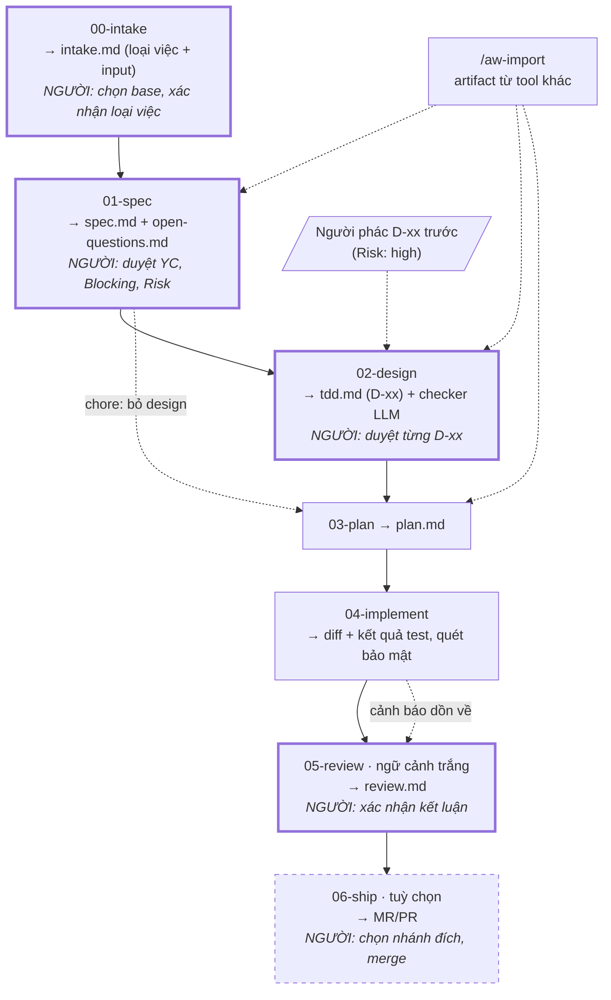

# agent-workflow

Quy trình phát triển phần mềm dựa trên AI agent, **không phụ thuộc vào một agent cụ thể**.

Repo này là nguồn của **engine**, phát hành theo tag `YYYY.M.N` ([CHANGELOG](CHANGELOG.md)).
Repo dự án chỉ chứa **quy ước** của mình (`docs/agent-workflow/conventions.md`, commit qua PR
như mọi thay đổi khác). Còn lại không vào git: wrapper `aw` cài global, engine trong cache,
cấu hình máy nằm trong `.git/` của bản clone, lệnh cho agent được sinh ra và bị exclude.
Adapter hiện có: **Claude Code**, **Cursor** (Codex, Copilot: có khe, chưa hiện thực).

| Đọc gì | Ở đâu |
|---|---|
| **Hướng dẫn dùng cho người**: cài, cấu hình, từng phase sinh artifact gì và quyết định gì | [`docs/huong-dan.md`](docs/huong-dan.md) |
| Luật từng phase (nguồn sự thật) | [`workflow/phases/`](workflow/phases), [`workflow/rules/`](workflow/rules) |
| Vì sao thiết kế như vậy, điểm yếu | [`docs/kien-truc.md`](docs/kien-truc.md) |
| Adapter | [`adapters/README.md`](adapters/README.md) |
| Phát triển chính repo này (cho agent) | [`AGENTS.md`](AGENTS.md) |

## Ý tưởng cốt lõi

> Mỗi phase là một hộp **file vào → file ra**, không dựa vào ngữ cảnh hội thoại.

Agent nào cũng đọc/ghi được file, nên mỗi phase chạy được bằng Claude Code, Cursor, một người,
hay một phiên mới sau khi bị nén ngữ cảnh. Hai hệ quả:

- **Mỗi phase chạy được từ phiên trắng.** Không chạy được = phase trước ghi thiếu.
- **Vào ở phase nào cũng được.** Artifact làm bằng tool khác đưa vào qua `/aw-import`, vẫn
  phải qua checker và gate người của phase lẽ ra sinh ra nó.

Bốn nguyên tắc:

1. **Bàn giao bằng file** — không phase nào biết gì về phase sau nó.
2. **Trung lập agent** — luật nằm trong file, mẫu và script `aw`, không trong prompt.
3. **Agent không tự duyệt** — máy kiểm được thì máy kiểm; còn lại người quyết.
4. **Flow không tắc** — checker chính xác thì chặn; kiểm chéo hay báo nhầm thì cảnh báo,
   `review` là cổng chặn cuối.

Lựa chọn kỹ thuật được tách thành mục **D-xx** để người *quyết định*, không phải đọc duyệt văn xuôi.

## Các phase



| Lệnh | Đọc → ghi | Máy chặn (`aw check …`) | Người |
|---|---|---|---|
| `/aw-intake` | ticket, URL, file, lời người → `intake.md` | loại việc, input, `Base`, `Engine` | chọn base, xác nhận loại việc và input |
| `/aw-spec` | input trong `intake.md` → `spec.md`, `open-questions.md` | mọi YC truy được về nguồn; điểm mù khớp hai file | duyệt YC, `Blocking`, `Risk`; tick "Approved by human" |
| `/aw-design` | spec đã duyệt → `tdd.md` | đủ mục, D-xx hợp lệ, YC được ánh xạ, checker LLM không còn `Chặn` | duyệt từng D-xx |
| `/aw-plan` | D-xx đã duyệt → `plan.md` | mọi YC có task phủ hoặc hoãn có lý do | — |
| `/aw-implement` | `plan.md` → diff | test và quét bảo mật **xanh** (máy tự chạy), mọi task có bằng chứng | — |
| `/aw-review` | mọi artifact + diff → `review.md` | từng YC có kết luận; không còn cảnh báo; kết quả còn mới so với code | xác nhận kết luận |
| `/aw-ship` | `review.md` → MR/PR | review đạt, không còn `Blocker` | chọn nhánh đích, merge |
| `/aw-clarify [YC-NNN]` | — | — | trả lời điểm mù, phân xử phát hiện checker LLM (từng mục, có phương án đề xuất); có `YC-NNN`: đổi một YC bạn không đồng ý (ghi thành điểm mù đã trả lời) |
| `/aw-bootstrap` | repo, CI, `git log` → `AGENTS.md`, `Makefile`, `ARCHITECTURE.md`, ADR có sẵn (một lần, trong worktree `chore`) | `aw conventions check`, `aw adr check`, `aw rule check` | trả lời câu hỏi trong báo cáo, mở PR |

- **Không có phase test riêng** — test là điều kiện ra của `implement`: chưa xanh là chưa xong.
- **Loại việc đổi luật** (`feature | bugfix | refactor | perf | chore`): bugfix cần test tái hiện
  đỏ trước khi sửa, refactor cấm hành vi mới, perf cần số đo trước/sau, chore bỏ design và không
  đụng code production. Chi tiết: [`00-intake.md`](workflow/phases/00-intake.md).
- **Worktree bắt buộc.** Checkout chính chỉ chạy `/aw-intake`, `/aw-bootstrap` (đề xuất worktree,
  **bạn chọn base**) và `/aw-ship` (dọn việc đã merge). Mọi phase khác chạy trong worktree, mỗi việc
  một phiên.

### Ô duyệt

Spec và mỗi D-xx có một ô; bạn duyệt bằng cách đổi `[ ]` thành `[x]`:

```markdown
- [x] **Approved by human** — đã đọc và đồng ý toàn bộ spec <!-- approval-hash: 3f2a9c01d4e7b6a8 -->
```

- Máy ghi **dấu duyệt** (hash nội dung) lần đầu thấy tick. Nội dung đổi sau đó → `aw check` chặn.
  Duyệt lại bản mới: đọc chỗ đổi, xoá `<!-- approval-hash: … -->`, giữ tick.
- **Agent không bao giờ tick**; sửa nội dung đã tick thì bỏ tick. Muốn máy chặn cứng: cài hook
  `aw guard` ([Claude Code](adapters/claude-code/README.md#hook-gác-ô-duyệt) ·
  [Cursor](adapters/cursor/README.md#hook-gác-ô-duyệt)).
- Gõ `/aw-design` hay `/aw-plan` khi chưa duyệt: agent in bản tóm tắt máy dựng (`aw approval`) —
  file, dòng phải tick, điểm nên đọc kỹ — rồi hỏi: **Tôi đã duyệt xong — kiểm lại** /
  **Giải thích từng điểm cần duyệt** / **Dừng — tôi duyệt sau**.

### Kết quả của mọi lệnh `aw`

Mọi script in khối **Kết quả** cuối output, đánh `[x]` vào đúng một nhãn — người và agent đọc
nhãn, không đọc mã thoát:

```
Kết quả: check-plan.sh
  [ ] ĐẠT — được sang phase sau
  [x] KHÔNG ĐẠT — có vi phạm, sửa trong phase này
  [ ] THIẾU ĐẦU VÀO — chưa có file cần kiểm
```

## Cài đặt

Engine không cài vào repo đích. Bốn phần:

| Phần | Ở đâu | Ai giữ |
|---|---|---|
| Wrapper `aw` | `~/.local/bin/aw` (một file POSIX sh) | mỗi máy, cài một lần |
| Engine | `~/.agent-workflow/engine/<YYYY.M.N>/` | cache theo version, tải khi cần |
| Quy ước repo | `docs/agent-workflow/conventions.md` | trong git, cả team dùng chung, sửa qua PR |
| Cấu hình repo | `$(git rev-parse --git-common-dir)/agent-workflow/` | từng bản clone, mọi worktree dùng chung, **không commit** |

### 1. Cài `aw`

```sh
mkdir -p ~/.local/bin
curl -fsSL https://github.com/dangminhphuc/agent-workflow/releases/download/2026.10.24/aw -o ~/.local/bin/aw
chmod +x ~/.local/bin/aw
aw version
```

Cần `sh`, `git`, `tar`, `gzip`, `curl`/`wget`, `sha256sum`/`shasum` (`aw doctor` kiểm hết).
Không cần Node hay Python. Windows: Git Bash.

### 2. `aw init` trong repo đích

```sh
cd /đường/dẫn/repo-của-bạn        # checkout chính, đứng ở nhánh gốc
aw init --test-cmd "npm test"
```

`aw init` tải engine, kiểm và **ghim** sha256, tạo `.git/agent-workflow/`:

```
version          ← engine cho việc MỚI
checksums        ← sha256 đã ghim của từng version
conventions.md   ← (tuỳ chọn) chỉ ghi đè khoá của máy: worktree_dir
config.sh        ← ADAPTER, TEST_CMD, SECURITY_CMDS, PERF_CMD, WORKTREE_SETUP_CMD
archive/         ← artifact của worktree đã gỡ
journal/         ← nhật ký harness (aw journal)
```

rồi thêm `/.agent-workflow/` và thư mục của adapter vào `.git/info/exclude`, sinh adapter ở
checkout chính. Repo chưa có quy ước thì `aw init` tạo `docs/agent-workflow/conventions.md` từ mẫu
(không bao giờ ghi đè). Sửa file đó (kiểm bằng `aw conventions check`; giải thích từng khoá:
[`conventions-reference.md`](workflow/templates/conventions-reference.md)), **commit qua PR**, rồi
mở agent ở checkout chính và chạy `/aw-intake`. Chưa merge vẫn chạy được: aw đọc bản ở checkout
chính.

- **Mỗi việc đọc quy ước tại điểm rẽ khỏi base** của nó: việc sửa `conventions.md` không đổi luật
  của chính nó, thay đổi có hiệu lực cho việc sau khi merge.
- **Repo init bằng engine cũ** (quy ước chỉ ở `.git/agent-workflow/conventions.md`): vẫn chạy như
  cũ; `aw conventions check` cảnh báo và in cách chuyển vào repo.

**Cấu hình chung của team:** đặt `version`, `checksums`, `config.sh` vào một repo riêng, mỗi
người chạy `aw init --from <url>` (`--force` để lấy đè bản ở máy). Repo đã có quy ước trong git
thì `--from` bỏ qua `conventions.md` của repo cấu hình (không để hai nguồn sự thật).

**Lệnh test và quét bảo mật** trong `config.sh` là điều kiện ra của `implement` — bỏ trống là
KHÔNG ĐẠT, không phải "bỏ qua". `SECURITY_CMDS` phải chép **đúng lệnh, config, ngưỡng
của pipeline CI**.
Tên khoá trước 2026.10.21 (`LENH_KIEM_THU`, `LENH_KIEM_TRA_BAO_MAT`…) vẫn đọc được; `aw ready` nhắc đổi.

### 3. Repo đích: để một phiên agent mới không phải đoán (khuyến nghị)

Engine không ép, chỉ nhắc ở `aw init`. Repo có sẵn thì làm một lần bằng `/aw-bootstrap` ở checkout
chính: agent đề xuất worktree `chore`, trong đó dựng các file dưới **chỉ từ bằng chứng trong repo**
(điều chỉ người biết thành câu hỏi trong báo cáo), tạo ADR cho quyết định đã có, liệt kê ứng viên luật
`BR-` và chạy bài kiểm tra phiên mới. Mục tiêu: phiên agent mới **chỉ có repo** trả lời được năm
câu — hệ thống là gì, tổ chức ra sao, chạy và kiểm thế nào, vì sao code như vậy, đang ở đâu.

```
AGENTS.md                      điểm vào, 50–100 dòng, chỉ TRỎ TỚI (CLAUDE.md: một dòng .md)
Makefile | package scripts     lệnh chuẩn: setup, test, lint, security — CI gọi đúng các lệnh này
docs/agent-workflow/conventions.md   quy ước quy trình (aw init tạo)
src/<module>/ARCHITECTURE.md   ràng buộc, quyết định chỉ của module — đặt cạnh code
```

- Mẫu: `.agent-workflow/.engine/templates/target-repo/{AGENTS.md,Makefile}` (có sau `aw init`).
- **Lệnh kiểm trong git**: `config.sh` khai `TEST_CMD="make test"` và `secret: make
  security-secret`… thay vì chép lệnh — sửa Makefile là local và CI cùng đổi.
- Muốn agent đọc `ARCHITECTURE.md` của module trong phase: khai vào `rules_design`,
  `rules_implement` của `conventions.md` (`aw rules` in ra, review chấm từng file).
- Mỗi luật một chỗ: phạm vi một module thì đặt cạnh module, nhiều module thì trong `docs/`.
- **Vì sao code như vậy — ADR** (`docs/adr/`): quyết định D-xx mà người duyệt kèm `- Promote: adr`
  được `aw adr promote` chép thành ADR ngay trong PR của việc. Phase design đọc chỉ mục và ADR
  liên quan qua `aw knowledge design`; D đi ngược ADR phải ghi `- Supersedes: ADR-NNNN`.
- **Luật nghiệp vụ bền** (`docs/product/rules/<miền>.md`): YC là bất biến nghiệp vụ, người duyệt spec
  kèm `- Promote: BR-<MIỀN>-NNN`, được `aw rule promote` chép thành khối `### BR-…` (nguồn có phiên
  bản). Phase spec đọc luật active qua `aw knowledge spec`; test gắn `covers: BR-…` như với YC.
- **Chống lỗi thời**: diff đụng phạm vi của tài liệu module, ADR hay file luật mà tài liệu không đổi
  → implement cảnh báo; review phải ghi verdict từng tài liệu ở `## Durable knowledge`
  (`pass | updated | not applicable`).
- **Phép thử tay** (khi đổi bố trí, hay mỗi bản phát hành): mở một phiên agent mới chỉ với repo, hỏi
  hệ thống là gì, tổ chức ra sao, chạy và kiểm thế nào, vì sao code như vậy, đang ở đâu. Câu nào
  agent phải đoán là chỗ còn thiếu trong repo.

### 4. Skill, subagent của team cho từng phase (tuỳ chọn)

`aw` không cài skill, subagent hay plugin. Team tự đưa chúng vào repo, rồi khai trong
`docs/agent-workflow/conventions.md` phase nào dùng gì. Có hai khoá, khác nhau ở chỗ agent **đọc**
hay **gọi**:

| Khoá | Agent làm gì | Dùng cho |
|---|---|---|
| `rules_<phase>` | Chạy `aw rules <phase>`, **đọc** từng file như tài liệu | Hướng dẫn viết code, `ARCHITECTURE.md`, checklist — chữ thuần |
| `uses_<phase>` | Chạy `aw uses <phase>`, **gọi** từng skill / subagent qua cơ chế của agent | Skill dùng tham số, chèn lệnh shell, `allowed-tools`, hook; subagent cần giao việc |

`<phase>` là `spec`, `design`, `plan`, `implement`, `review`.

**Vì sao phải gọi mà không đọc.** Đọc `SKILL.md` như tài liệu thì agent vẫn làm theo chữ trong đó,
nhưng mất phần Claude Code xử lý khi **chạy** skill. POC (Claude Code 2.1.294, 2026-10):

| Tính năng của skill | Gọi qua Skill tool | Đọc như tài liệu |
|---|---|---|
| Thay tham số (`$ARGUMENTS`) | có | không |
| Dòng chèn kết quả lệnh shell | có | không |
| `allowed-tools` (không hỏi quyền) | có | không |
| `hooks` trong frontmatter | có | không |

Cursor (`cursor-agent`, 2026-10) không có tool gọi skill theo tên: với `uses_*`, agent Cursor vẫn
đọc file và làm theo, frontmatter không có hiệu lực — như `rules_*`. Subagent thì Cursor gọi được.

**Cách làm** — ví dụ cho phase implement dùng skill `go-senior` và subagent `db-migrator`:

1. Đặt file vào repo. Cursor nạp cả `.claude/`, nên một bản dùng chung cho hai agent:
   ```
   .claude/skills/go-senior/SKILL.md     skill: name: go-senior (= tên thư mục)
   .claude/agents/db-migrator.md         subagent: name: db-migrator (= tên file)
   ```
   - Skill **không** được có `disable-model-invocation: true` — agent sẽ không gọi được (máy chặn).
   - Skill / subagent từ **plugin** hay cài cho cả máy (`~/.claude/skills/`): chép thư mục của nó
     vào `.claude/skills/` của repo. Máy chỉ nhận thứ nằm trong repo — máy khác, CI, người review
     cũng có đúng bản đó.
2. Commit vào base. `aw init` exclude cả `/.claude/` (nơi adapter Claude Code sinh file), nên phải
   thêm `-f`: `git add -f .claude/skills/go-senior .claude/agents/db-migrator.md`. File đã
   commit thì sửa sau không cần `-f`; file **mới** thêm vào thư mục đó vẫn cần.
3. Khai trong `conventions.md`, commit qua PR như mọi thay đổi quy ước:
   ```
   uses_implement: skill:go-senior agent:db-migrator
   ```
4. Claude Code: cho phép gọi skill không cần hỏi, trong `.claude/settings.json` của repo (commit
   bằng `-f`) hoặc cấu hình của máy — không có thì mỗi lần agent gọi skill, người phải bấm duyệt:
   ```json
   { "permissions": { "allow": ["Skill(go-senior)"] } }
   ```
5. Kiểm: `aw conventions check` (khai sai thì ✗), `aw uses implement` in đúng
   `skill:go-senior .claude/skills/go-senior/SKILL.md`.

Không cần build lại adapter: lệnh `/aw-*` đọc `aw uses` lúc chạy. Sửa `conventions.md` có hiệu lực
cho việc rẽ khỏi base **sau khi** PR quy ước được merge.

**Khi chạy phase**

- Đầu phase, agent chạy `aw rules <phase>` (đọc), rồi `aw uses <phase>` và gọi từng mục trước việc
  đầu tiên. Claude Code: skill qua Skill tool, subagent qua `subagent_type`.
- Máy **chặn** phase (`aw check <phase>`, `aw uses` ra `KHAI SAI`) khi: mục sai dạng, tên có `:`
  (plugin), file không có trong repo, chưa commit, hay skill khoá model; khoá gõ nhầm phase
  (`uses_implment`).
- Máy **không** kiểm được agent đã thật sự gọi skill hay chưa. Lưới cuối là review: `aw rules review`
  in thêm file định nghĩa của **mọi** mục `uses_*`, và `review.md` phải có một dòng kết luận cho từng
  file ở `## Repo rules` (thiếu là chặn) — người rà soát đối chiếu diff với skill đó.
- Skill, subagent xếp **dưới** `spec.md`, `tdd.md`, `plan.md`: skill bảo refactor rộng thì agent vẫn
  giữ diff trong phạm vi, ghi xung đột vào "Unplanned".

**Lưu ý**

- Skill cho phép model gọi thì model cũng có thể **tự** gọi nó ngoài phase, khi thấy việc khớp
  `description`. Muốn hạn chế, viết rõ trong `description`: "Only use when an /aw-* command says so".
- MCP server (`.mcp.json`) không khai ở đây: đó là cấu hình công cụ, agent dùng khi có sẵn.
- Chỉ cần agent đọc chữ của skill (không dùng các tính năng ở bảng trên) thì khai đường dẫn
  `SKILL.md` vào `rules_<phase>` là đủ.

### Lệnh

| Lệnh | Việc |
|---|---|
| `aw init [--version V] [--adapter a[,b]] [--test-cmd "…"] [--from <url>] [--from-legacy]` | Tạo cấu hình, exclude, sinh adapter |
| `aw upgrade <V>` | Đổi engine cho việc mới (việc đang làm giữ version cũ) |
| `aw version` · `aw doctor` | Version đang dùng · kiểm cài đặt |
| `aw ready <thư-mục-feature> [--no-test]` | Worktree sẵn sàng chưa (test xanh trên base) và bước tiếp |
| `aw conventions check` | Kiểm `conventions.md` |
| `aw check <tên> <thư-mục-feature>` | Checker máy: `intake spec design plan implement review repro perf security ship` |
| `aw task next\|start\|done <thư-mục-feature> [T-NN]` | Trạng thái task do máy giữ |
| `aw task reopen <thư-mục-feature> <YC-NNN\|D-NN>` | YC vừa đổi / D-xx mở lại: chỉ task phủ nó về `[ ]` |
| `aw journal` · `aw journal add <lớp> "<mô tả>"` | Nhật ký harness: checker trượt ở đâu, loại lỗi lặp lại |
| `aw worktree new\|status\|remove …` | Đề xuất / tạo / dọn worktree |
| `aw ship targets\|create\|status\|sweep …` | Gửi MR/PR, theo dõi, dọn việc đã merge |
| `aw adapter build [a[,b]] [--out <dir>] [--force]` | Sinh lại adapter |
| `aw adr promote <thư-mục-feature> D-NN` · `aw adr check` | Chép D-xx đã duyệt (`Promote: adr`) thành ADR trong repo · kiểm thư mục ADR |
| `aw rule promote <thư-mục-feature> YC-NNN` · `aw rule check` | Chép YC đã duyệt (`Promote: BR-…`) thành luật nghiệp vụ · kiểm mọi luật `BR-` |
| `aw feature` · `aw input` · `aw pending` · `aw based-on` · `aw rename` · `aw rules` · `aw uses` · `aw knowledge` · `aw approval` | Lệnh agent gọi trong phase |
| `aw guard pre\|post` | Hook gác ô duyệt |

### Nhiều agent trong một team

```sh
aw init --adapter claude-code,cursor     # hoặc ADAPTER="claude-code cursor" trong config.sh
```

- Mỗi worktree có cả `.claude/` lẫn `.cursor/`; đổi agent giữa các phase được (bàn giao bằng file,
  cùng `aw check`, cùng version engine ghim trong `intake.md`).
- Hai adapter sinh từ cùng bộ sinh; test đòi hợp đồng phase giống hệt nhau từng byte.
- Lệnh trùng tên để bản `.cursor/` che bản `.claude/` (Cursor nạp cả `.claude/`).
- Mỗi worktree chỉ một agent chạy tại một lúc (hook gác ô duyệt dùng mốc chung).

### Nâng cấp, chạy không mạng, chuyển từ bộ cài cũ

- `aw upgrade <V>`: tải, ghim sha256, sinh lại adapter. **Việc đang làm không đổi luật** — mọi
  `aw check` chạy đúng version ở dòng `Engine:` của `intake.md`; không có thì `KHÔNG HỢP LỆ`.
- Không mạng: `AW_ENGINE_DIR` (engine có sẵn, `VERSION` phải khớp), `AW_MIRROR`
  (`<mirror>/<V>/agent-workflow-<V>.tar.gz` + `SHA256SUMS`, nhận `file://`), `AW_CACHE`.
- Repo còn `.agent-workflow/.quy-trinh/` của bộ cài cũ: `aw init --from-legacy` — chép cấu hình
  sang `.git/agent-workflow/`, chỉ in lệnh `git rm` để bạn dọn bằng một PR.

### Artifact chỉ ở máy

`.agent-workflow/<tên-branch>/` bị exclude: PR chỉ có code. `aw worktree remove` (và `aw ship
sweep --apply`) chép artifact vào `.git/agent-workflow/archive/<tên>/` trước khi gỡ worktree.

## Chạy test và phát hành

```sh
sh tools/run-tests.sh
```

Version `YYYY.M.N`: năm, tháng, `N` = số thứ tự bản trong tháng (không số 0 đứng đầu). Tag trùng
đúng chuỗi đó, không có `v`.

1. Ghi thay đổi vào `## [Chưa phát hành]` của `CHANGELOG.md`.
2. Trong PR muốn phát hành: `sh tools/prepare-release.sh [YYYY.M.N]` — ghi version vào
   `VERSION`, `bin/aw`, CHANGELOG, link tải trong README. Commit vào PR.
3. Workflow `kiem-tra` chạy test + `tools/check-release.sh` (version nhất quán, tag chưa có).
4. Merge vào `main` → workflow `release` tự tạo tag + Release (tarball, `aw`, `SHA256SUMS`).

Cách tay: đặt version như bước 2, merge, rồi `git tag -a V -m V && git push origin V` (hoặc tạo
Release trên giao diện GitHub với tag mới, target `main`).
