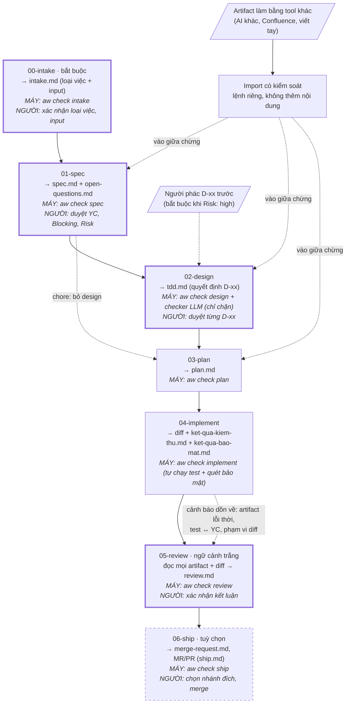

# agent-workflow

Quy trình phát triển phần mềm dựa trên AI agent, **không phụ thuộc vào một agent cụ thể**.

Repo này là *nguồn* của **engine**, phát hành theo tag `YYYY.M.N`
([CHANGELOG](CHANGELOG.md)). Repo dự án không chứa gì của quy trình: wrapper `aw`
cài global lấy đúng version engine vào cache, cấu hình nằm trong `.git/` của bản
clone, và adapter sinh lệnh riêng cho agent bạn đang dùng — tất cả bị exclude,
không bao giờ phải commit vào nhánh gốc (xem [Cài đặt](#cài-đặt)). Hiện có adapter
cho **Claude Code** và **Cursor** — team dùng cả hai thì mỗi worktree có cả hai bộ
lệnh, cùng một hợp đồng phase (xem [Nhiều agent trong một team](#nhiều-agent-trong-một-team));
Codex, Copilot có khe cắm nhưng chưa hiện thực.

## Ý tưởng cốt lõi

Tính không-phụ-thuộc-agent **không đến từ lớp trừu tượng hoá API**. Nó đến từ một
quy ước đơn giản hơn nhiều:

> Mỗi phase là một hộp **file vào → file ra**, không dựa vào ngữ cảnh hội thoại.

Agent nào cũng đọc và ghi được file. Vì vậy mỗi phase chạy được bằng Claude Code,
bằng Cursor, bằng một người, hay bằng một phiên mới sau khi phiên cũ đã bị nén
ngữ cảnh. Adapter chỉ làm một việc: dịch định nghĩa phase sang dạng native của
từng agent cho tiện gọi.

Hệ quả kiểm chứng được: **mỗi phase phải chạy được từ một phiên trắng.** Nếu một
phase không chạy nổi khi mở phiên mới, phase trước đã ghi thiếu.

Hệ quả thứ hai: **vào quy trình ở phase nào cũng được.** Artifact có thể được tạo
bằng tool bất kỳ — AI khác, Confluence, viết tay — rồi đưa vào đúng phase cần.
Điều kiện: nó vẫn phải qua checker và gate người của phase lẽ ra đã sinh ra nó
(xem [Đưa artifact từ ngoài vào](#đưa-artifact-từ-ngoài-vào)).

Nền tảng gồm bốn nguyên tắc:

1. **Bàn giao bằng file** — không phase nào biết gì về phase đứng sau nó.
2. **Trung lập agent** — phần lõi nằm trong file, mẫu và script, không nằm trong prompt.
3. **Agent không tự duyệt** — điều gì máy kiểm được thì máy kiểm; còn lại người quyết.
4. **Flow không tắc** — chỉ chặn khi checker chính xác; kiểm chéo hay báo nhầm thì
   cảnh báo, `review` là cổng chặn cuối.

Và một lớp quản trị quyết định: các quyết định kỹ thuật được tách thành mục
**D-xx** riêng, để người duyệt *quyết định* chứ không phải đọc duyệt cả một bài
văn xuôi.

## Các phase



Cách đọc:

- **Viền đậm** = phase có gate **NGƯỜI**. `plan` và `implement` không có người —
  chúng chỉ thực thi những gì đã duyệt ở `spec` và `design`.
- **MÁY** = lệnh phải chạy xanh trước khi agent được nói "xong". Lệnh fail thì
  quay lại sửa trong chính phase đó.
- **Mũi tên nét đứt "cảnh báo"** = kiểm chéo giữa phase: không chặn giữa chừng,
  nhưng dồn về `review` — cổng chặn cuối — và chưa xử lý thì `review` chặn.
- **"Vào giữa chừng"** = artifact từ tool khác, sau khi import, vẫn phải qua
  checker và gate người của phase lẽ ra đã sinh ra nó.

```
00-intake     [bắt buộc]  tài liệu hoặc lời người dùng     →  intake.md
01-spec       [bắt buộc]  intake.md + các input nó liệt kê →  spec.md + open-questions.md
02-design     [bắt buộc*] spec.md                            →  tdd.md          (*chore bỏ qua)
03-plan       [bắt buộc]  spec.md + tdd.md                   →  plan.md
04-implement  [bắt buộc]  plan.md + tdd.md                   →  diff + ket-qua-kiem-thu.md + ket-qua-bao-mat.md
05-review     [bắt buộc]  mọi artifact + diff                →  review.md
06-ship       [tuỳ chọn]  review.md + mọi artifact + diff  →  merge-request.md + MR/PR (ship.md)
```

- **Không có phase test riêng.** Test là **điều kiện ra** của `implement`: chưa
  xanh nghĩa là chưa xong. Một phase test đặt phía sau sẽ biến "code xong" thành
  trạng thái hợp lệ dù chưa ai chạy gì.
- **Vận hành không phải phase.** Incident note là một loại nguồn đầu vào của `spec`.

### Người tham gia ở đâu

| Phase | Người | Người làm gì |
|---|---|---|
| `intake` | có | Xác nhận **loại việc** và danh sách input (lời mình được chép đúng nguyên văn) |
| `spec` | có | Duyệt yêu cầu, nhãn `Blocking` của `[OPEN-QUESTION]`, và `Risk`; rồi tick ô `Approved by human` ở đầu spec. Trả lời điểm mù qua `/aw-clarify` |
| `design` | có | Duyệt **từng D-xx** trong `tdd.md` (tick ô `Approved by human` của D đó); phân xử phát hiện của checker LLM qua `/aw-clarify` |
| `plan` | không | — |
| `implement` | không | — |
| `review` | có | Xác nhận kết luận; làm trọng tài cho phát hiện của checker |
| `ship` | có | Chọn nhánh đích; xác nhận tiêu đề, mô tả trước khi tạo MR; review và merge trên GitHub/GitLab; đồng ý dọn worktree |

`plan` và `implement` không có người vì chúng chỉ thực thi những gì đã được duyệt
ở `spec` và `design`.

### `00-intake` — tiếp nhận: loại việc và input

Điểm xuất phát bắt buộc của mọi việc. `intake.md` trả lời đúng ba câu:

1. **Loại việc** (dòng `Type`) — `feature | bugfix | refactor | perf | chore`. Gợi ý từ tiền tố
   branch (`loai_theo_tien_to` trong `conventions.md`), **người xác nhận**, và
   `intake.md` là nguồn sự thật. Loại lệch tiền tố branch thì cảnh báo, `review`
   chặn — **không có ngoại lệ**: sửa loại, hoặc đổi tên bằng
   `aw rename` (đổi cả branch, thư mục artifact và thư mục worktree).
2. **Input** — tài liệu có định danh (`[JIRA]`, `[CONFLUENCE]`, `[FILE]`), hoặc
   lời người dùng **chép nguyên văn** (`[HUMAN]`). Không có `[INFERRED]` ở đây:
   suy đoán của agent mà vào input thì mọi phase sau truy về nó như có nguồn.
3. **Mục tiêu** một câu (dòng `Goal`).

Kèm dòng **Base** — base người chọn khi tạo worktree (xem dưới); checker phía sau
so diff với base này — và dòng **Engine**: version engine của việc, mọi `aw check`
chạy đúng version đó.

`00` chỉ **trỏ tới** tài liệu, không tóm tắt hay diễn giải BRD — nếu không nó
thành một lớp diễn giải chen giữa tài liệu thật và spec.

**Cách gọi:** `/aw-intake JIRA-123 https://confluence/…` — tham số là **input**, không
phải tên feature (các lệnh khác thì tham số là tên feature). Tên feature luôn lấy
từ branch.

**Worktree là bắt buộc.** Checkout chính luôn đứng ở `nhanh_goc` và chỉ dùng để
chạy `/aw-intake`; mọi lệnh khác chạy ở đó đều bị chặn (`ĐANG Ở CHECKOUT CHÍNH`). `/aw-intake` ở checkout
chính: agent chốt loại việc với bạn, rồi chạy `aw worktree new <loại-việc>
<mô-tả>` — script **chỉ đề xuất**:

```
  Tên        fix_phi-hoan-tien   (tiền tố fix_ ← bugfix)
  Đường dẫn  /home/dev/shop.wt/fix_phi-hoan-tien
             (thu_muc_worktree: ../{repo}.wt/{ten})

  Base — chọn một:
     [1] main               c629505  2 hours ago  "…"
         nhanh_goc local — ⚠ chậm 2 commit so với origin/main
   ★ [2] origin/main        80dc1bf  1 hour ago   "…"
         bản remote tính tới lần fetch cuối: 2026-09-29 17:25 (script không tự fetch)
     [3] release/1.2        c629505  3 days ago   "…"
         khớp mau_nhanh_phat_hanh — hợp với bugfix gấp trên bản đã phát hành
     [4] ref khác — người nhập (branch, tag, commit). Branch việc khác (xếp chồng): review sẽ cảnh báo
```

**Bạn chọn base**; ★ là gợi ý của máy theo một luật cố định (giữa `main` và
`origin/main`, bản nào chứa bản kia; phân kỳ thì không gợi ý), không phải của
agent. Agent chạy lại với `--create --base <ref bạn chọn>` — thiếu `--base` là
bị từ chối. Script tạo worktree (branch `--no-track`, để `git push` trơn không đẩy lên
`main`), in hai dòng `Base:` và `Engine:` để ghi vào `intake.md`, sinh adapter vào worktree mới, và nhắc bạn chuẩn bị môi trường
(`LENH_CHUAN_BI_WT`) rồi **mở phiên agent mới** trong worktree để chạy `/aw-spec`.

Branch, thư mục worktree và thư mục artifact dùng **cùng một tên**. Worktree đặt
**ngoài** repo (mặc định `../{repo}.wt/{ten}`), để tool không quét trùng code và
agent không đọc nhầm artifact của worktree khác; mỗi máy ghi đè được bằng biến
môi trường `AW_THU_MUC_WORKTREE`.

**Vì sao ghi Base.** Checker so diff với điểm rẽ nhánh khỏi base, không phải
`nhanh_goc`. Tạo từ `origin/main` khi `main` local đang chậm, hay từ `release/*`,
mà so với `main` local thì commit của người khác bị tính cho việc này. Base là
branch việc khác (xếp chồng) vẫn được — nhập qua "ref khác" — nhưng `review`
cảnh báo để bạn xác nhận có chủ ý: việc dựa trên code chưa được review.

**Dọn dẹp.** `aw worktree status <tên-branch>` chạy từ checkout chính chỉ in
trạng thái; `aw worktree remove <tên-branch>` chép artifact vào
`.git/agent-workflow/archive/` rồi gỡ worktree (branch giữ nguyên);
`--delete-branch` xoá thêm branch local bằng `git branch -d`. Không bao giờ
`--force` hay `-D`: còn thay đổi chưa commit thì chặn; squash-merge làm git từ
chối xoá branch thì bạn tự quyết `git branch -D`.

Nhãn input do **máy** gán: `aw input` nhận mã Jira (`mau_jira`),
URL Confluence (`mien_confluence`), file có thật trong repo. Chỉ cần một từ không
nhận ra thì **cả chuỗi** là lời người dùng, chép nguyên văn thành một mục
`[HUMAN]` — vd `/aw-intake sửa phí hoàn tiền bị âm ABC-123`; mã `ABC-123` trong
câu chỉ là đề xuất tách thêm, bạn đồng ý mới thành input riêng. Chạy lại `/aw-intake`
trong worktree đã có `intake.md` thì **gộp thêm** input mới (bỏ trùng), giữ nguyên
loại việc; `spec.md` khi đó thành lỗi thời và phải chạy lại `/aw-spec`.

Xếp loại theo **thay đổi gì về hành vi**, không theo "xây cái gì":

```
Có sửa code chạy trên production không?
├─ Không → chore
└─ Có → Hành vi quan sát từ bên ngoài có đổi không?
        ├─ Không → mục tiêu là nhanh hơn? → có: perf / không: refactor
        └─ Có → Hành vi hiện tại đang SAI so với tài liệu/ý định? → có: bugfix / không: feature
```

Loại việc **đổi luật** của các phase sau:

| Loại | Phase | Máy ghi / chặn thêm | Người phán |
|---|---|---|---|
| `feature` | đủ | — | — |
| `bugfix` | đủ | Spec có "Reproduction". `aw check repro` tự chạy test khi diff **mới chỉ đụng file test**, ghi `tai-hien.md`; test phải **đỏ** | Test đỏ **đúng vì bug** (review ghi "Repro test fails because: …") |
| `refactor` | đủ | YC chỉ `giữ nguyên \| cấu trúc`; YC giữ nguyên có `Protected by:` file test **có sẵn trên nhánh gốc**. Xoá test cũ → chặn; sửa test cũ phải khai ở "Modified existing tests" | Diff test cũ chỉ đổi import/cấu trúc |
| `perf` | đủ | Như refactor + YC `performance` có số liệu; `aw check perf --before/--after` tự đo, ghi `do-hieu-nang.md` | Số đo có đạt mục tiêu (đo dao động nên máy không chặn theo ngưỡng) |
| `chore` | bỏ design | Diff đụng `mau_code_production` → chặn; đụng `mau_file_dependency` thì plan phải có bảng "Dependency upgrades" (chỉ `patch \| minor` — major là `refactor`) và lệnh quét nhóm `sca` phải chạy xanh | Mức phiên bản khai đúng |

Không phải loại riêng: `utils` (= feature hoặc refactor), `hotfix` (= bugfix gấp),
`security` (= bugfix/feature + rủi ro cao). `spike` nằm ngoài quy trình. Việc lai
(refactor kèm sửa bug) thì **tách branch** — luật hai loại xung đột nhau.

### `01-spec` — yêu cầu

Mỗi yêu cầu `YC-xxx` phải truy được về một input trong `intake.md` (Confluence, Jira, file cục
bộ). Chỗ chưa rõ ghi `[OPEN-QUESTION]` kèm **Blocking** do agent đề xuất, người duyệt
ở gate spec — đúng ba mức:

| Blocking | Sai giả định thì | Chặn gì |
|---|---|---|
| `blocking` | Cả thiết kế đổi hướng | `design` (chore: `plan`) và mọi phase sau, tới khi `answered` |
| `review-blocking` | Làm lại một phần code | Flow đi tiếp trên giả định tạm; `implement` cảnh báo, `review` chặn |
| `non-blocking` | Sửa nhỏ | Không chặn; `review` ghi YC đó `pending`, không được `pass` |

**`/aw-clarify`** — lệnh tiện ích, chạy bất cứ lúc nào sau `/aw-spec`. Máy
(`aw pending`) gom mọi việc đang chờ bạn quyết — điểm mù và phát hiện của checker
LLM (`phat-hien-*.md`) — theo thứ tự phải chốt trước. Với điểm mù:
mức chặn, rồi YC `must` trước `should`, rồi mục có nhiều task đứng trên giả
định hơn — và đánh dấu mục **đang chặn** phase kế tiếp. Danh sách đó để agent
đọc; bạn chỉ thấy một dòng tóm tắt. Rồi agent hỏi **từng mục một** bằng câu hỏi
lựa chọn (Claude Code: `AskUserQuestion`). Trước khi hỏi, agent **tự phân tích**
(nguồn, spec, thiết kế, code đã có) để đưa ra 2–3 **phương án giải pháp thật**,
mỗi phương án kèm đánh đổi một dòng; phương án nên chọn đứng đầu, nhãn bắt đầu
bằng `(Đề xuất)`, ngữ cảnh nói vì sao. Mục gói nhiều quyết định thì tách thành
nhiều câu hỏi. Cuối là "Chưa trả lời được"; luôn có ô tự nhập và "Chat về câu
này". Bạn trả lời → agent ghi nguyên văn, đổi nhãn nguồn trong
spec, chạy lại checker. Câu trả lời khác giả định thì agent cho bạn xem dòng YC
sẽ sửa, bạn đồng ý trong hội thoại là xong. Spec đã tick duyệt thì sửa nào cũng
làm nó khác bản đã duyệt: agent bỏ tick, bạn tick lại. Chưa trả lời được → agent soạn sẵn tin nhắn gửi người
cần hỏi. Agent không tự trả lời, không tự hạ mức chặn.

Với phát hiện của checker LLM, lựa chọn là các **cách sửa cụ thể** (cách đề xuất
đứng đầu; chọn thì agent cho bạn xem dòng `tdd.md` sẽ đổi, rồi ghi `đã sửa`; cần
quyết định mới thì thêm D-xx chưa tick để bạn duyệt), **Bác bỏ** (kèm lý do, ghi
nguyên văn — agent thấy phát hiện sai thì đề xuất bác bỏ), và **Để sau** với mục
`Cảnh báo`. Phát hiện agent đã tự sửa lúc chạy
`/aw-design` được nêu lại trong tổng kết để bạn biết. Điểm mù và phát hiện vẫn ở
**file riêng** — chỉ hàng đợi là chung.

Spec cũng gắn `Risk: high | normal`. **High** khi đụng tiền/hạch toán, tích
hợp mới, schema lõi, hoặc thay đổi khó đảo ngược.

Gate người để lại dấu vết trong file: ô `- [ ] **Approved by human**` ở đầu
`spec.md`, chỉ người tick; `design` (chore: `plan`) chặn tới lúc đó. Khi một
`[OPEN-QUESTION]` được trả lời, `open-questions.md` và nhãn nguồn trong spec phải đổi
cùng nhau — checker đối chiếu hai chiều.

#### Ô duyệt

Spec và mỗi D-xx có một ô duyệt; bạn duyệt bằng cách đổi `[ ]` thành `[x]`:

```markdown
- [x] **Approved by human** — đã đọc và đồng ý toàn bộ spec <!-- approval-hash: 3f2a9c01d4e7b6a8 -->
```

- **Dấu duyệt** do máy ghi lần đầu thấy tick (`aw check`, hoặc hook): hash của
  nội dung lúc đó. Nội dung đổi sau đó mà tick còn thì `aw check` chặn "đổi sau
  duyệt". Duyệt lại bản mới: đọc chỗ đổi, xoá `<!-- approval-hash: … -->` (giữ tick).
  Dòng trống, chú thích và `- Critique (agent):` dưới D không tính.
- **Agent không bao giờ tick**, không sửa dấu duyệt; agent sửa nội dung đã tick thì
  bỏ tick. Muốn máy chặn cứng thay vì chỉ dặn: cài hook `aw guard` cho Claude Code
  ([adapters/claude-code/README.md](adapters/claude-code/README.md#hook-gác-ô-duyệt))
  hay Cursor ([adapters/cursor/README.md](adapters/cursor/README.md#hook-gác-ô-duyệt))
  — ô nào được tick trong lúc lệnh của agent chạy thì bị bỏ tick và agent được báo.
- Ô duyệt phải đúng chỗ (spec: trước heading `##` đầu tiên; D-xx: trong mục của
  nó), đúng một ô; ô trong chú thích hay khối code không được tính.
- **Gõ lệnh phase sau khi chưa duyệt** (vd `/aw-design` khi spec chưa tick, `/aw-plan`
  khi còn D chưa tick): agent không làm gì của phase mà in bản tóm tắt máy dựng
  từ file (`aw approval`) rồi hỏi bằng hộp xác nhận:

  ```text
  CỔNG DUYỆT — vào /aw-design cần spec đã được bạn duyệt
  Việc:        feat_x
  Trạng thái:  ✗ CHƯA DUYỆT — ô "Approved by human" chưa tick
  Cách duyệt:  mở .agent-workflow/feat_x/spec.md, dòng 12
               đổi   - [ ] **Approved by human**
               thành - [x] **Approved by human**

  Nên đọc kỹ trước khi tick (máy không kiểm thay được):
    1. Yêu cầu agent tự suy ra [INFERRED] — 3 mục, nguồn không ghi trực tiếp:
         YC-006 — …
    2. Out of scope — 2 mục: …
    3. Risk: high — /aw-design chạy Mode 2: BẠN phác các quyết định D-xx trước, agent viết phần còn lại
    4. Điểm mù còn mở: 0
  ```

  Ba lựa chọn: **Tôi đã duyệt xong — kiểm lại** (agent kiểm lại; đạt thì vào phase
  ngay), **Giải thích từng điểm cần duyệt**, **Dừng — tôi duyệt sau**. Agent
  không bao giờ tick hộ — kể cả khi bạn bảo "duyệt hộ".
- Việc bắt đầu trước bản có ô duyệt vẫn chạy bằng engine ghi trong `intake.md` của
  nó (dòng `Status:` cũ). Engine mới gặp dạng cũ thì báo cách đổi.

### `02-design` — Technical Design Document

Output duy nhất: `tdd.md` (Technical Design Document, **không phải** Test-Driven
Development). Nó chứa mọi thông tin `implement` cần để làm đúng kỹ thuật:

- Existing code — code hiện có
- **Decisions (D-xx)** — người duyệt từng mục; mục này được phép rỗng
- Data model + ERD
- Contract / API
- Flow, sequence, state (Mermaid)
- Yêu cầu phi chức năng
- Test strategy
- YC mapping → mục thiết kế

Mục không áp dụng ghi `Not applicable: <lý do>` chứ không bỏ trống. Mục chi tiết
ghi `Based on: D-xx`; checker LLM tìm chỗ lệch D-xx và các quyết định ngầm chưa
được nêu thành D.

Mỗi D-xx có `Author: human | agent` và một ô `- [ ] **Approved by human**`.
**Chỉ người** tick; `/aw-plan` chặn nếu còn D chưa tick. Chưa tick mà có
`Reopen reason:` là D đang mở lại (`reopened`).

Hai cách làm:

- **Mode 1** — agent viết cả `tdd.md` một lần, người duyệt.
- **Mode 2** — người phác các mục D-xx trước (`Author: human`), agent viết phần
  còn lại và chỉ **phản biện** quyết định của người. Spec có `Risk: high` mà
  chưa có bản phác của người thì `design` chặn — để tránh người duyệt bị neo vào
  phương án agent đưa ra.

**Mở lại quyết định:** mở lại đúng một D-xx, sửa tại chỗ (lịch sử để git giữ), ghi
bỏ tick ô duyệt của D đó + thêm dòng `Reopen reason:` (trạng thái `reopened`). Grep `Based on: D-xx` ra các task bị ảnh hưởng, chỉ
các task đó đặt lại `[ ]`; người chỉ duyệt lại D đang mở.

### `03-plan` — quản lý thực thi

`plan.md` chỉ còn phần thực thi: task, thứ tự/phụ thuộc, `Covers: YC-xxx`,
`Based on: D-xx`, `Design: tdd.md § …`, Expected files, Verify, task dựa
trên giả định, trạng thái, Unplanned, Deferred. Nó tách khỏi `tdd.md` để việc
tick task không bao giờ sửa vào tài liệu thiết kế đã duyệt.

### `04-implement` — code + test

- Test gắn tag `covers: YC-xxx`. YC chưa có test → **cảnh báo**. YC không test tự
  động được ghi `Kiểm chứng: thủ công` + lý do.
- So `git diff --name-only <nhánh-gốc>...HEAD` với "Expected files" (cho phép glob)
  và "Unplanned" của plan. File ngoài phạm vi → **cảnh báo**.

### `05-review` — rà soát độc lập

Chạy bằng phiên/subagent có ngữ cảnh trắng, không phải phiên vừa viết code. Đây
là **cổng chặn cuối**: mọi cảnh báo từ phase trước (artifact lỗi thời, YC chưa có
test, diff ngoài phạm vi) chưa xử lý thì `review` chặn.

Bốn lăng kính: đúng đặc tả (từng YC), đúng thiết kế và phạm vi (+ quy tắc repo),
chất lượng, và **bảo mật** — bảng bảy hạng mục cố định (injection, authn/authz,
dữ liệu nhạy cảm, secret/config, crypto, SSRF/path traversal/deserialization,
dependency mới), mỗi dòng `pass | finding | not applicable` kèm vị trí/lý do. Máy
quét bắt mẫu đã biết; lăng kính này bắt ý đồ — endpoint thiếu kiểm quyền, log lộ PII.
`Blocker` gồm cả lỗ hổng khai thác được, mất/lộ dữ liệu, breaking change chưa khai.

## Cổng chặn

Điều kiện ra chia hai loại. Loại **NGƯỜI** thì agent nêu ra rồi dừng. Loại **MÁY**
thì agent không được tự tuyên bố đạt — phải chạy lệnh:

| Phase | Lệnh | Bắt cái gì |
|---|---|---|
| `intake` | `aw check intake` | Loại việc ngoài 5 loại, thiếu mục tiêu, không có input, `[INFERRED]` trong input, `[HUMAN]` không kèm nguyên văn |
| `spec` | `aw check spec` | Yêu cầu không truy được về nguồn → agent bịa yêu cầu; thiếu phần bắt buộc theo loại việc; `open-questions.md` lệch spec; `Blocking` thiếu/sai |
| `design` | `aw check design` | Spec chưa được người duyệt (hoặc đổi sau khi duyệt), điểm mù `blocking` còn mở, thiếu mục, D-xx thiếu/sai ô duyệt hoặc đổi sau khi duyệt, `Based on` trỏ sai, YC chưa ánh xạ, rủi ro cao mà thiếu bản phác của người, checker LLM chưa chạy hoặc còn phát hiện `Chặn` |
| `plan` | `aw check plan` | D-xx chưa được người duyệt (hoặc đổi sau khi duyệt), task thừa, và **yêu cầu bị bỏ sót** (kiểm hai chiều) |
| `implement` | `aw check implement` | Test chưa xanh, quét bảo mật chưa khai hoặc đỏ, task còn dở |
| `review` | `aw check review` | Bỏ sót yêu cầu, kết luận "pass" khi còn giả định chưa xác nhận, điểm mù `blocking`/`review-blocking` còn mở, test hoặc quét bảo mật chưa xanh, kết quả lỗi thời so với code, Lens 4 thiếu hạng mục / thiếu lý do, hoặc **còn cảnh báo** |

Mọi script in khối **Kết quả** ở cuối output (ra stderr), đánh `[x]` vào đúng
một nhãn — người và agent đọc nhãn, không đọc mã số:

```
Kết quả: kiem-tra-ke-hoach.sh
  [ ] ĐẠT — được sang phase sau
  [x] KHÔNG ĐẠT — có vi phạm, sửa trong phase này
  [ ] THIẾU ĐẦU VÀO — chưa có file cần kiểm
```

Mã thoát vẫn còn — script gọi lẫn nhau cần nó — nhưng chỉ là chi tiết của máy.
Nhãn của từng script khai ở dòng `kq_khai` đầu script (`tools/lib/ket-qua.sh`).

`aw check implement` **tự chạy lệnh test và tự ghi output** vào
`ket-qua-kiem-thu.md`. Agent không có cơ hội viết lại kết quả bằng lời hay bịa
một dòng "tất cả test đã xanh".

Cùng cách đó với bảo mật: `aw check implement` (hoặc riêng `aw check security`)
chạy từng lệnh trong `LENH_KIEM_TRA_BAO_MAT` — **đúng lệnh, config, ngưỡng của
pipeline CI** (secret scan, SAST, SCA; mỗi dòng `<nhóm>: <lệnh>`) — và ghi
`ket-qua-bao-mat.md`. Chưa khai là KHÔNG ĐẠT. Hai file kết quả ghi `Tree` — dấu vân
tay nội dung code lúc chạy; `aw check review` chặn khi kết quả không xanh hoặc code
đã đổi sau lần chạy (kể cả chưa commit). Nhờ vậy việc qua review local không còn
bị pipeline chặn vì lỗi bảo mật mà máy dev chưa từng quét.

Adapter tự từ chối build nếu một mục `exit_machine` không phải lệnh chạy được —
nếu không, điều kiện loại NGƯỜI sẽ đội lốt loại MÁY và agent sẽ tự duyệt.

**Entry check:** checker của mỗi phase chạy lại checker của phase trước trên
đầu vào (`thiet-ke` → `truy-vet`, `ke-hoach` → `thiet-ke`, …). Artifact đưa từ
tool khác vào cũng phải qua đúng cổng đó.

### Chặn hay cảnh báo

| Loại checker | Ví dụ | Hành vi |
|---|---|---|
| **Chính xác** — hợp đồng output của chính phase | truy vết nguồn, phủ YC, test xanh | **Chặn** |
| **Kiểm chéo giữa phase**, hay báo nhầm | artifact lỗi thời, test ↔ YC, phạm vi diff | **Cảnh báo**; `review` chặn |

Tiêu chí xếp một checker mới: độ chính xác, chi phí nếu lọt, và nơi sửa rẻ nhất.

### Checker LLM: chỉ được chặn, không được duyệt

Checker dùng LLM (subagent `soat-thiet-ke`, định nghĩa ở
`workflow/checkers/thiet-ke.md`) ghi phát hiện ra `phat-hien-thiet-ke.md`;
`aw check design` fail nếu còn mục `Mức: Chặn` mà `Xử lý` chưa là `đã sửa`
hoặc `bác bỏ: <lý do>`. **Không có file phát hiện cũng là fail** — nghĩa là
checker chưa chạy. Người là **trọng tài theo ngoại lệ**: xác nhận, hoặc bác bỏ
kèm lý do. LLM không bao giờ là bên nói "đạt".

### Artifact lỗi thời

Mỗi artifact ghi `based_on` là hash **cả file** của đầu vào:

```
based_on:
  - spec.md@<hash>
```

Hash do máy ghi (`aw based-on`, dùng `cksum`, bỏ `\r`), không để
agent tự chép. `spec.md` dựa trên `intake.md`; `tdd.md` dựa trên `spec.md` +
`open-questions.md`; `plan.md` dựa trên `spec.md` + `tdd.md`. Lệch hash chỉ **cảnh báo** ở các phase sau; `review`
chặn nếu còn artifact lỗi thời.

### Kiểm chéo ở `implement`

`aw check implement` in **cảnh báo**, `aw check review` coi cùng phát hiện đó là **lỗi**
(chung một thư viện `tools/lib/kiem-cheo.sh`, nên hai nơi không lệch nhau):

| Kiểm chéo | Cách kiểm | Xử lý |
|---|---|---|
| Test ↔ YC | Tìm `covers: YC-xxx` trong file khớp `mau_file_test` | Thêm test, hoặc ghi "Manual verification" + lý do trong `plan.md` |
| Phạm vi diff | File đổi so với merge-base của base trong `intake.md` (kể cả chưa commit, file mới) so với "Expected files" + "Unplanned" + `bo_qua` | Hoàn tác, hoặc ghi vào "Unplanned" |
| Lỗi thời | `based_on` so với hash hiện tại | Chạy lại phase sinh ra artifact đó |
| Điểm mù | `Blocking: review-blocking` (hoặc `blocking`) còn `open` trong `open-questions.md` | Chốt với người qua `/aw-clarify` |

## Đưa artifact từ ngoài vào

Artifact làm bằng tool khác thường không đúng mẫu. Nó đi qua **bước import có
kiểm soát** — một lệnh riêng, không phải phase:

- Chỉ sắp xếp lại theo mẫu, **không thêm nội dung**.
- Gắn nhãn nguồn trỏ về tài liệu gốc; chỗ không rõ ghi `[OPEN-QUESTION]`.
- Kết quả chạy qua checker của phase tương ứng, và người xác nhận bản chuyển đổi.

Với Claude Code: `/aw-import <file-nguồn> <spec.md|tdd.md|plan.md>`. Định nghĩa trung
lập ở `workflow/import.md`.

Entry check của phase N chính là checker của phase N-1 chạy lại trên input, nên
không có đường tắt nào bỏ qua cổng chặn.

## Cài đặt

Từ bản 2026.10.6, quy trình **không cài vào repo đích nữa**. Không có file nào phải
commit vào `main`, `develop`, `uat`… — chạy được cả khi mọi nhánh gốc là
protected branch. Gồm ba phần:

| Phần | Ở đâu | Ai giữ |
|---|---|---|
| Wrapper `aw` | `~/.local/bin/aw` (một file POSIX sh) | mỗi máy, cài một lần |
| Engine (tools, checker, luật, mẫu, adapter) | `~/.agent-workflow/engine/<YYYY.M.N>/` | cache theo version, tải khi cần |
| Cấu hình của repo | `$(git rev-parse --git-common-dir)/agent-workflow/` | từng bản clone, dùng chung mọi worktree, **không commit** |

### 1. Cài `aw`

```sh
mkdir -p ~/.local/bin
curl -fsSL https://github.com/dangminhphuc/agent-workflow/releases/download/2026.10.13/aw -o ~/.local/bin/aw
chmod +x ~/.local/bin/aw
aw version
```

`aw` chỉ cần `sh`, `git`, `tar`, `gzip`, `curl` hoặc `wget`, `sha256sum` hoặc
`shasum`. `aw doctor` kiểm hết.

### 2. `aw init` trong repo đích

```sh
cd /đường/dẫn/repo-của-bạn        # checkout chính, đứng ở nhánh gốc
aw init --test-cmd "npm test"
```

`aw init`:

- tải engine (mặc định đúng version của wrapper; `--version YYYY.M.N` để chọn) vào
  cache, kiểm sha256 theo `SHA256SUMS` của bản phát hành, rồi **ghim** sha đó;
- tạo trong `.git/agent-workflow/`:

  ```
  version          ← YYYY.M.N — engine cho việc MỚI
  checksums        ← sha256 đã ghim của từng version (định dạng sha256sum)
  conventions.md   ← bạn viết; aw chỉ tạo mẫu, KHÔNG BAO GIỜ ghi đè
  config.sh        ← ADAPTER, LENH_KIEM_THU, LENH_KIEM_TRA_BAO_MAT, LENH_DO_HIEU_NANG (perf), LENH_CHUAN_BI_WT; không ghi đè
  archive/         ← artifact của worktree đã gỡ (aw worktree remove)
  ```

- thêm `/.agent-workflow/` và đường dẫn mọi adapter khai (`/.claude/`; Cursor:
  `/.cursor/commands/`, `/.cursor/agents/`, `/.cursor/skills/quy-trinh-agent/`) vào
  `.git/info/exclude`;
- sinh adapter ở checkout chính — mỗi adapter trong `ADAPTER` của `config.sh`
  (mặc định `claude-code`; `aw init --adapter claude-code,cursor` cho team dùng cả hai).

Rồi sửa `.git/agent-workflow/conventions.md`, mở agent ở checkout chính và chạy
`/aw-intake` — nó đề xuất worktree cho việc. Base chọn tuỳ ý: base không cần có gì
của quy trình. Các phase sau chạy trong worktree:
`/aw-intake` → `/aw-spec` → `/aw-design` → `/aw-plan` → `/aw-implement` → `/aw-review`.

**Cấu hình chung của team.** Đặt `version`, `checksums`, `conventions.md`,
`config.sh` vào một repo riêng (không phải repo dự án), rồi mỗi người:

```sh
aw init --from git@github.com:team/agent-workflow-config.git
```

File đã có ở máy thì giữ; `--force` để lấy bản của team.

### Lệnh

| Lệnh | Việc |
|---|---|
| `aw init [--version YYYY.M.N] [--adapter <id>[,<id>…]] [--test-cmd "…"] [--from <url>] [--from-legacy]` | Tạo cấu hình, exclude, sinh adapter |
| `aw upgrade <YYYY.M.N>` | Đổi engine cho việc mới |
| `aw version` · `aw doctor` | Xem version đang dùng · kiểm môi trường |
| `aw check <tên> <thư-mục-feature>` | Checker máy — `intake spec design plan implement review repro perf` |
| `aw worktree new <loại> <mô-tả> [--create --base <ref>]` | Đề xuất / tạo worktree cho việc |
| `aw worktree status <branch>` · `aw worktree remove <branch> [--delete-branch]` | Dọn worktree sau khi merge |
| `aw adapter build [<agent>[,<agent>…]] [--out <thư-mục>] [--force]` | Sinh lại adapter — bỏ trống agent: mọi adapter trong `ADAPTER` |
| `aw feature` · `aw input` · `aw pending` · `aw based-on` · `aw rename` · `aw rules <phase>` | Lệnh agent gọi trong các phase |
| `aw approval design\|plan <thư-mục-feature>` | Cổng duyệt khi vào phase: còn gì chờ người duyệt — lệnh `/aw-design`, `/aw-plan` gọi |
| `aw guard pre` · `aw guard post` | Hook gác ô duyệt — cấu hình ở [Claude Code](adapters/claude-code/README.md#hook-gác-ô-duyệt) · [Cursor](adapters/cursor/README.md#hook-gác-ô-duyệt) |

### Artifact của việc: chỉ ở máy

Artifact (`.agent-workflow/<tên-branch>/`) bị exclude: PR chỉ có code, reviewer
không thấy `spec.md`, `tdd.md`… trong diff. Checker so diff vốn đã bỏ qua thư mục
này. Gỡ worktree bằng `aw worktree remove` thì artifact được **chép vào**
`.git/agent-workflow/archive/<tên>/` trước — `git worktree remove` trơn sẽ xoá
mất, vì file bị ignore không nằm trong commit nào.

### Nhiều agent trong một team

Người dùng Claude Code, người dùng Cursor, cùng một repo:

```sh
aw init --adapter claude-code,cursor     # hoặc sửa ADAPTER="claude-code cursor" trong config.sh rồi aw init
```

- Mỗi worktree (và checkout chính) có cả `.claude/` lẫn `.cursor/`: ai mở bằng agent
  nào cũng có `/aw-intake`, `/aw-spec`… Đổi agent giữa các phase được (vd `/aw-spec` bằng
  Claude Code, `/aw-implement` bằng Cursor) — phase bàn giao bằng file, `aw check` như nhau,
  dòng `Engine:` của `intake.md` ghim cùng version.
- **Một hợp đồng phase cho mọi agent:** cả hai adapter sinh từ cùng bộ sinh
  (`adapters/lib/chung.sh`); chỉ cách hỏi lựa chọn, cách truyền tham số và đầu file
  là riêng. Test hồi quy đòi phần còn lại giống hệt nhau từng byte.
- Cursor cũng nạp `.claude/` (chế độ tương thích, bật sẵn). Lệnh, subagent, skill của
  hai adapter **trùng tên** để bản `.cursor/` che bản `.claude/`; file `.claude/` còn
  dòng "Dành cho Claude Code" để Cursor nạp nhầm thì dừng.
- **Mỗi worktree chỉ một agent chạy tại một lúc** — hook gác ô duyệt dùng một mốc
  chung trong worktree.
- `aw doctor` báo worktree thiếu bộ lệnh của một agent (`aw adapter build` để sinh).

### Nâng cấp

```sh
aw upgrade 2.1.0
```

Tải, kiểm và ghim sha256 của bản mới, ghi `version`, sinh lại adapter ở checkout
chính. **Việc đang làm không đổi luật:** mỗi việc ghi `- **Engine:** YYYY.M.N` trong
`intake.md` lúc tạo worktree, và mọi `aw check` của việc chạy đúng version đó.
Máy không có version đó và không tải được thì `aw check` báo `KHÔNG HỢP LỆ` —
không bao giờ chạy tạm bằng version khác. So version: khớp chính xác `YYYY.M.N`.

Dùng chung cho team: commit `version` + `checksums` mới vào repo cấu hình của team.

### Chạy không có mạng

| Biến | Dùng khi |
|---|---|
| `AW_ENGINE_DIR=/đường/dẫn/engine` | Máy hoặc CI không có mạng: dùng engine có sẵn (một bản giải nén của release, hoặc bản checkout repo này đúng tag). `VERSION` của nó vẫn phải khớp chính xác |
| `AW_MIRROR=https://mirror.noi-bo/agent-workflow` | Tải từ mirror khác thay cho GitHub. Cấu trúc: `<AW_MIRROR>/<YYYY.M.N>/agent-workflow-<YYYY.M.N>.tar.gz` và `SHA256SUMS`; nhận cả `file://` |
| `AW_CACHE=/đường/dẫn` | Đổi chỗ cache (mặc định `~/.agent-workflow/engine`), vd cache dùng chung trên CI |

Engine đã có trong cache thì không cần mạng nữa.

### Chuyển từ bộ cài cũ

Repo đã có `.agent-workflow/.quy-trinh/` commit trong base:

```sh
aw init --from-legacy
```

Lệnh chép `.agent-workflow/conventions.md` và `.quy-trinh/cau-hinh.sh` sang
`.git/agent-workflow/`. Nó **không xoá, không commit gì** — chỉ in các lệnh
`git rm` để người dọn bộ cài cũ bằng một PR bình thường (qua review) khi tiện.
Trong lúc đó, file `.claude/` cũ git còn theo dõi được adapter **bỏ qua**, không
ghi đè. `tools/cai-dat.sh` và `tools/dong-bo.sh` giờ chỉ in hướng dẫn này.

### Artifact theo feature và `conventions.md`

Artifact của mỗi feature nằm trong `.agent-workflow/<tên-branch>/`, dùng **tên
branch đầy đủ** (vd `feat_tao-todo`) để feat và refactor cùng tên không đè nhau.

Cách xác định feature đang làm:

0. Đang ở checkout chính → `ĐANG Ở CHECKOUT CHÍNH` (worktree là bắt buộc);
1. Suy từ tên branch hiện tại theo quy ước trong `conventions.md`;
2. không khớp thì lấy tham số của lệnh;
3. không có tham số thì dừng lại hỏi.

Agent luôn in `Đang làm với: …` trước khi bắt đầu. Thứ tự này nằm trong script
`aw feature` (kết quả `ĐÃ XÁC ĐỊNH`, `CẦN HỎI NGƯỜI` hoặc `ĐANG Ở CHECKOUT CHÍNH`), không nằm trong
prompt — adapter nào cũng dùng chung. Branch có `/` được đổi thành `_`.

`conventions.md` (trong `.git/agent-workflow/`) là của repo đích, do bạn viết. Phần máy đọc là một khối
` ```conventions ` gồm các dòng `khoá: giá trị`:

| Khoá | Ví dụ | Dùng cho |
|---|---|---|
| `mau_branch` | `feat_* fix_* refactor_*` | Quy ước tên branch; `xxx` không nhất thiết là mã Jira |
| `nhanh_goc` | `main` | Nhánh checkout chính đứng; ứng viên base chính. Diff so với base trong `intake.md`, chỉ quay về khoá này khi intake chưa có Base |
| `thu_muc_worktree` | `../{repo}.wt/{ten}` | Vị trí worktree (ngoài repo); ghi đè theo máy bằng `AW_THU_MUC_WORKTREE` |
| `mau_nhanh_phat_hanh` | `release/*` | Nhánh phát hành — ứng viên base; base khớp thì review không cảnh báo |
| `nhanh_dich_mr` | `develop uat/* main` | Nhánh được làm đích MR (`/aw-ship`), theo thứ tự hiện cho người chọn; bỏ trống = `nhanh_goc` |
| `nen_tang_mr` | `gitlab` | `github` / `gitlab` — `/aw-ship` tạo MR bằng `gh` / `glab`; bỏ trống = đoán từ URL của origin |
| `bo_qua` | `package-lock.json` | File đổi không cần nằm trong plan |
| `mau_file_test` | `*.test.* test/*` | File nào là test |
| `the_covers` | `covers:` | Tag đứng trước mã YC trong test |
| `loai_theo_tien_to` | `feat_=feature fix_=bugfix` | Tiền tố branch → loại việc (gợi ý ở `/aw-intake`, đối chiếu ở review) |
| `mau_code_production` | `src/*` | Code production — `chore` không được đụng; bugfix/perf đo "trước" khi chưa đụng |
| `mau_file_dependency` | `package.json` | Manifest/lockfile — `chore` đụng vào thì phải khai "Dependency upgrades" |
| `quy_tac_<phase>` | `quy_tac_implement: docs/coding-style.md .claude/skills/api/SKILL.md` | Quy tắc riêng của repo — xem bên dưới |

Danh sách cách nhau bằng dấu cách; trong glob, `*` khớp cả `/`.

#### Quy tắc riêng của repo (`quy_tac_<phase>`)

Coding style, skill của agent, chuẩn kiến trúc, thuật ngữ nghiệp vụ… gắn vào đúng
phase cần nó: `quy_tac_spec`, `quy_tac_design`, `quy_tac_plan`, `quy_tac_implement`,
`quy_tac_review`. Giá trị là danh sách file, đường dẫn tương đối với gốc repo.

- Agent chạy `aw rules <phase>` ở đầu phase rồi đọc từng file. Danh sách đọc lúc
  chạy, nên sửa `conventions.md` là có hiệu lực ngay, không cần build lại adapter.
- File phải **đã commit** vào base: worktree mới chỉ có file đã commit. Không có,
  chưa commit, hay khoá gõ nhầm → `aw check` của phase đó chặn. Skill để trong
  `.claude/` thì commit bằng `git add -f` — `aw init` exclude cả `/.claude/` (Cursor:
  `/.cursor/commands/`, `/.cursor/agents/`).
- `review` đối chiếu diff với **mọi** khoá: mục "Repo rules" của `review.md` có
  một dòng `pass` / `violation` / `not applicable` cho từng file, thiếu là chặn.
- Quy tắc repo xếp dưới `spec.md`, `tdd.md`, `plan.md`. Quy tắc máy kiểm được
  (lint, type, kiến trúc) nên đưa vào `LENH_KIEM_THU` — để máy chặn, không chỉ để
  agent đọc.

## Cấu trúc repo

```
VERSION, CHANGELOG.md    version engine (YYYY.M.N) và thay đổi từng bản
workflow.yaml            manifest trung lập — nguồn sự thật duy nhất (phases:, commands:)
workflow/
  phases/*.md            định nghĩa phase (frontmatter + mô tả); exit_machine là "aw check <tên>"
  checkers/*.md          định nghĩa checker LLM (chỉ được chặn)
  import.md              lệnh import artifact từ ngoài (không phải phase)
  open-questions.md      lệnh dẫn người chốt điểm mù theo thứ tự ưu tiên (không phải phase)
  rules/*.md             luật áp dụng cho mọi phase
  templates/*.md         mẫu cho từng artifact + conventions.md, config.sh
bin/
  aw                     wrapper cài global: chọn version, tải + kiểm sha256, chuyển lệnh
  aw-engine              điểm vào của engine: init, check, worktree, adapter, feature…
adapters/
  README.md              hợp đồng adapter (hook), nhiều adapter, ghi chú Codex
  lib/chung.sh           bộ sinh dùng chung (ad_sinh) — adapter chỉ khai hook
  claude-code/build.sh   biên dịch sang .claude/**; claude-code/exclude: đường dẫn cần exclude
  cursor/build.sh        biên dịch sang .cursor/{commands,agents,skills}/**
tools/                   (engine — gọi qua aw, không gọi thẳng)
  khoi-tao.sh            aw init: cấu hình, exclude, adapter; --from-legacy
  sinh-adapter.sh        aw adapter build: chép rules/templates vào .agent-workflow/.engine/ + build từng adapter
  kiem-tra-*.sh          các cổng chặn bằng máy (aw check)
  xac-dinh-feature.sh    aw feature: checkout chính → chặn; branch → tham số → hỏi
  tao-worktree.sh        aw worktree new: đề xuất worktree — người chọn base rồi mới tạo
  don-worktree.sh        aw worktree status|remove (không --force, không -D)
  gui-mr.sh              aw ship targets|create|status: nhánh đích, tạo MR/PR (gh/glab), trạng thái → ship.md
  don-viec-da-merge.sh   aw ship sweep: dọn worktree + branch của việc đã merge (từ checkout chính)
  doi-ten-feature.sh     aw rename: đổi tên branch + thư mục artifact + worktree
  phan-loai-input.sh     aw input: tham số → dòng "## Input" (nhãn do máy gán)
  liet-ke-viec-cho.sh    aw pending: việc chờ người (điểm mù, phát hiện LLM) theo thứ tự phải chốt
  quy-tac-repo.sh        aw rules: file quy tắc riêng của repo cho một phase (quy_tac_* trong conventions.md)
  cap-nhat-based-on.sh   aw based-on: ghi hash đầu vào vào frontmatter artifact
  cong-duyet.sh          aw approval design|plan: tóm tắt cho người còn gì chờ duyệt (cổng duyệt khi vào phase)
  gac-duyet.sh           aw guard pre|post: hook bỏ tick ô duyệt agent tick / nội dung đổi sau duyệt
  dong-goi.sh            đóng gói bản phát hành (tarball + SHA256SUMS)
  chuan-bi-phat-hanh.sh  đặt version YYYY.M.N cho PR phát hành (VERSION, bin/aw, CHANGELOG, README)
  kiem-tra-phat-hanh.sh  kiểm version nhất quán + tag chưa có (CI của PR) — không phải aw check
  cai-dat.sh, dong-bo.sh đã bỏ — chỉ in hướng dẫn chuyển sang aw
  chay-thu.sh            test hồi quy cho cổng chặn, wrapper, đóng gói
  lib/                   md.sh, kiem-cheo.sh, duyet.sh (ô duyệt + dấu duyệt), worktree.sh, moi-truong.sh (AW_REPO/AW_CONFIG), bang-lenh.sh, ket-qua.sh, mr.sh (gh/glab, ship.md)
docs/kien-truc.md        vì sao thiết kế như vậy, cách thêm phase/adapter
```

## Yêu cầu môi trường

POSIX shell + `awk` + `sed` + `git`; wrapper cần thêm `tar`, `gzip`, `curl` hoặc
`wget`, `sha256sum` hoặc `shasum` để tải engine. Không cần Node, Python.
Trên Windows dùng Git Bash (Claude Code có sẵn Bash trên mọi nền tảng).

`/aw-ship` không cần token: có `gh` / `glab` đã đăng nhập thì dùng; GitLab không
có `glab` thì tạo MR bằng git push options; còn lại in link tạo MR điền sẵn.

## `06-ship` — gửi MR và dọn việc

Tuỳ chọn: việc đã qua `/aw-review` muốn gửi MR/PR bằng quy trình thì chạy `/aw-ship`.
Lệnh có hai chế độ, theo chỗ gõ:

**Trong worktree của việc**

1. Agent viết `merge-request.md` theo mẫu (`templates/merge-request.md` + mục
   "Merge request" của `conventions.md`), chạy `aw check ship` — chặn khi review
   chưa đạt, `review.md` còn `[Blocker]`, mô tả thiếu mục / còn chữ giữ chỗ.
2. `aw ship targets` liệt kê nhánh đích theo `nhanh_dich_mr` (vd `develop uat/*
   main`), đánh dấu base của việc và nhánh nào sẽ kéo theo commit không thuộc
   việc. **Bạn chọn.**
3. Bạn xác nhận tiêu đề + mô tả + đích; agent chạy `aw ship create --target
   <nhánh>`: push branch, tạo MR, ghi `ship.md`. Engine không giữ token — tạo MR
   theo đường đầu tiên dùng được: `gh`/`glab` đã đăng nhập (đủ tiêu đề + mô tả);
   GitLab không có `glab` → **git push options** (`merge_request.create`, chỉ cần
   quyền git của bạn; chỉ gửi được tiêu đề, mô tả để ở `mo-ta-mr.md` cho bạn dán);
   còn lại → link tạo MR điền sẵn, bạn bấm tạo rồi đưa link cho agent (`--url`).
   GitLab: bật xoá source branch khi merge. Chạy lại cùng đích sau khi sửa theo review chỉ push
   thêm commit — không tạo MR mới. Vào nhiều nhánh: mỗi nhánh một MR.
4. `aw ship status` hỏi nền tảng: còn mở / đã merge / bị đóng. Không có CLI thì
   suy từ git: merge thường, và squash merge sạch (commit trên đích có cùng
   patch-id với toàn bộ thay đổi của branch).

**Ở checkout chính** — `aw ship sweep` duyệt mọi worktree có `ship.md`, liệt kê
việc nào dọn được (mọi MR đã merge). Bạn đồng ý thì `--apply`: gỡ worktree (chép
artifact vào archive như `aw worktree remove`), xoá branch local, xoá branch trên
origin. Xoá cứng (`git branch -D`, cần khi squash merge) chỉ khi đầu branch trùng
đúng sha mà MR đã merge; lệch thì dừng cho bạn quyết.

Agent không merge, không duyệt MR. Theo dõi định kỳ: chạy lại `/aw-ship` ở checkout
chính theo lịch (vd `/loop` của Claude Code).

Việc tạo bằng engine cũ (dòng `Engine:` trong `intake.md` trước bản có `/aw-ship`)
chạy `aw ship …` bằng engine đó nên không có lệnh này: hoặc gửi MR tay, hoặc
`aw upgrade` rồi sửa dòng `Engine:` của việc (mọi `aw check` sẽ chấm lại bằng
engine mới). Wrapper `aw` cũng phải là bản mới.

## Chạy test và phát hành

```sh
sh tools/chay-thu.sh
```

Phát hành: version là `YYYY.M.N` — năm, tháng, và `N` là số thứ tự bản phát
hành trong tháng (1, 2, 3, …; sang tháng mới đếm lại từ 1), không số 0 đứng đầu,
vd `2026.10.8`, `2026.11.1`. Tag trùng đúng chuỗi đó, không có `v`. Phát hành
bao nhiêu bản trong ngày cũng được.

**Cách thường dùng — phát hành bằng merge PR:**

1. Ghi thay đổi vào mục `## [Chưa phát hành]` của `CHANGELOG.md` như bình thường.
2. Trong PR muốn phát hành, chạy:

   ```sh
   sh tools/chuan-bi-phat-hanh.sh          # tự tính: tháng này, số lớn nhất ở remote + 1
   sh tools/chuan-bi-phat-hanh.sh 2026.10.9  # hoặc tự đặt
   ```

   Script ghi cùng một version vào `VERSION`, `AW_WRAPPER_VERSION` trong `bin/aw`,
   tiêu đề mục CHANGELOG (`[Chưa phát hành]` → `[<version>]`) và link tải wrapper
   trong README. Commit các file đó vào PR.
3. Workflow `kiem-tra` chạy trên PR: test hồi quy, và `tools/kiem-tra-phat-hanh.sh`
   kiểm version nhất quán + tag chưa có. Hai PR cùng lấy một số thì PR merge sau
   bị chặn ở đây — chạy lại script để lấy số kế tiếp.
4. Merge vào `main` → workflow `release` thấy tag của `VERSION` chưa có thì tự
   chạy test, đóng gói, tạo tag + Release. PR không đổi `VERSION` thì không phát
   hành gì.

**Cách tay (vẫn dùng được):** đặt version như bước 2, merge, rồi push tag:

```sh
git checkout main && git pull
git tag -a 2026.10.9 -m 2026.10.9
git push origin 2026.10.9
```

hoặc trên giao diện GitHub: **Releases → Draft a new release → Choose a tag**, gõ
version, chọn **Create new tag on publish**, **Target: main**, rồi **Publish
release**.

Workflow `release` kiểm tag khớp `VERSION`, chạy test, đóng gói
(`tools/dong-goi.sh`) và gắn `agent-workflow-YYYY.M.N.tar.gz`, `aw`,
`SHA256SUMS` vào Release — tạo Release mới nếu chưa có, hoặc gắn vào Release vừa
tạo trên giao diện (ghi chú lấy từ `CHANGELOG.md` nếu bạn để trống). Release tạo
trên giao diện hiện ra trước khi workflow chạy xong; workflow lỗi (tag lệch
`VERSION`, test hỏng) thì Release không có file và `aw` chưa tải được — xem tab
Actions.
