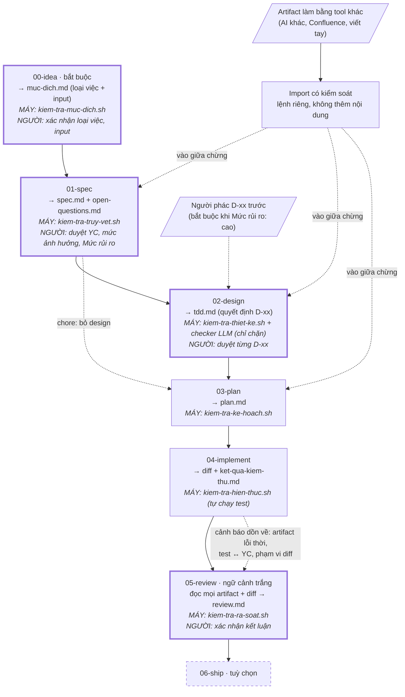

# agent-workflow

Quy trình phát triển phần mềm dựa trên AI agent, **không phụ thuộc vào một agent cụ thể**.

Repo này là *nguồn*. Bạn cài nó vào repo dự án thật, nó sinh ra artifact riêng cho
agent bạn đang dùng. Hiện có adapter cho **Claude Code**; Cursor và Copilot đã có
khe cắm trong manifest nhưng chưa hiện thực.

## Ý tưởng cốt lõi

Tính không-phụ-thuộc-agent **không đến từ lớp trừu tượng hoá API**. Nó đến từ một
quy ước đơn giản hơn nhiều:

> Mỗi phase là một hộp **file vào → file ra**, không dựa vào ngữ cảnh hội thoại.

Agent nào cũng đọc và ghi được file. Vì vậy mỗi phase chạy được bằng Claude Code,
bằng Cursor, bằng một người, hay bằng một phiên mới sau khi phiên cũ đã bị nén
ngữ cảnh. Adapter chỉ làm một việc: dịch định nghĩa phase sang dạng native của
từng agent cho tiện gọi.

Hệ quả kiểm chứng được: **mỗi phase phải chạy được từ một phiên trắng.** Nếu một
phase không chạy nổi khi mở phiên mới, phase trước đã ghi thiếu.

Hệ quả thứ hai: **vào quy trình ở phase nào cũng được.** Artifact có thể được tạo
bằng tool bất kỳ — AI khác, Confluence, viết tay — rồi đưa vào đúng phase cần.
Điều kiện: nó vẫn phải qua checker và gate người của phase lẽ ra đã sinh ra nó
(xem [Đưa artifact từ ngoài vào](#đưa-artifact-từ-ngoài-vào)).

Nền tảng gồm bốn nguyên tắc:

1. **Bàn giao bằng file** — không phase nào biết gì về phase đứng sau nó.
2. **Trung lập agent** — phần lõi nằm trong file, mẫu và script, không nằm trong prompt.
3. **Agent không tự duyệt** — điều gì máy kiểm được thì máy kiểm; còn lại người quyết.
4. **Flow không tắc** — chỉ chặn khi checker chính xác; kiểm chéo hay báo nhầm thì
   cảnh báo, `review` là cổng chặn cuối.

Và một lớp quản trị quyết định: các quyết định kỹ thuật được tách thành mục
**D-xx** riêng, để người duyệt *quyết định* chứ không phải đọc duyệt cả một bài
văn xuôi.

## Các phase



Cách đọc:

- **Viền đậm** = phase có gate **NGƯỜI**. `plan` và `implement` không có người —
  chúng chỉ thực thi những gì đã duyệt ở `spec` và `design`.
- **MÁY** = lệnh phải chạy xanh trước khi agent được nói "xong". Lệnh fail thì
  quay lại sửa trong chính phase đó.
- **Mũi tên nét đứt "cảnh báo"** = kiểm chéo giữa phase: không chặn giữa chừng,
  nhưng dồn về `review` — cổng chặn cuối — và chưa xử lý thì `review` chặn.
- **"Vào giữa chừng"** = artifact từ tool khác, sau khi import, vẫn phải qua
  checker và gate người của phase lẽ ra đã sinh ra nó.

```
00-idea       [bắt buộc]  tài liệu có định danh, hoặc lời người dùng  →  muc-dich.md
01-spec       [bắt buộc]  muc-dich.md + các input nó liệt kê →  spec.md + open-questions.md
02-design     [bắt buộc*] spec.md                            →  tdd.md          (*chore bỏ qua)
03-plan       [bắt buộc]  spec.md + tdd.md                   →  plan.md
04-implement  [bắt buộc]  plan.md + tdd.md                   →  diff + ket-qua-kiem-thu.md
05-review     [bắt buộc]  mọi artifact + diff                →  review.md
06-ship       [tuỳ chọn]  phụ thuộc hạ tầng CI của repo đích
```

- **Không có phase test riêng.** Test là **điều kiện ra** của `implement`: chưa
  xanh nghĩa là chưa xong. Một phase test đặt phía sau sẽ biến "code xong" thành
  trạng thái hợp lệ dù chưa ai chạy gì.
- **Vận hành không phải phase.** Incident note là một loại nguồn đầu vào của `spec`.

### Người tham gia ở đâu

| Phase | Người | Người làm gì |
|---|---|---|
| `idea` | có | Xác nhận **loại việc** và danh sách input (lời mình được chép đúng nguyên văn) |
| `spec` | có | Duyệt yêu cầu, nhãn mức ảnh hưởng của `[CẦN-HỎI]`, và `Mức rủi ro` |
| `design` | có | Duyệt **từng D-xx** trong `tdd.md` |
| `plan` | không | — |
| `implement` | không | — |
| `review` | có | Xác nhận kết luận; làm trọng tài cho phát hiện của checker |
| `ship` | có | Tuỳ hạ tầng |

`plan` và `implement` không có người vì chúng chỉ thực thi những gì đã được duyệt
ở `spec` và `design`.

### `00-idea` — mục đích và loại việc

Điểm xuất phát bắt buộc của mọi việc. `muc-dich.md` trả lời đúng ba câu:

1. **Loại việc** — `feature | bugfix | refactor | perf | chore`. Gợi ý từ tiền tố
   branch (`loai_theo_tien_to` trong `conventions.md`), **người xác nhận**, và
   `muc-dich.md` là nguồn sự thật. Loại lệch tiền tố branch thì cảnh báo, `review`
   chặn — **không có ngoại lệ**: sửa loại, hoặc đổi tên branch bằng
   `tools/doi-ten-feature.sh` (dời luôn thư mục artifact).
2. **Input** — tài liệu có định danh (`[JIRA]`, `[CONFLUENCE]`, `[FILE]`), hoặc
   lời người dùng **chép nguyên văn** (`[NGƯỜI-DÙNG]`). Không có `[SUY-RA]` ở đây:
   suy đoán của agent mà vào input thì mọi phase sau truy về nó như có nguồn.
3. **Mục tiêu** một câu.

`00` chỉ **trỏ tới** tài liệu, không tóm tắt hay diễn giải BRD — nếu không nó
thành một lớp diễn giải chen giữa tài liệu thật và spec.

Xếp loại theo **thay đổi gì về hành vi**, không theo "xây cái gì":

```
Có sửa code chạy trên production không?
├─ Không → chore
└─ Có → Hành vi quan sát từ bên ngoài có đổi không?
        ├─ Không → mục tiêu là nhanh hơn? → có: perf / không: refactor
        └─ Có → Hành vi hiện tại đang SAI so với tài liệu/ý định? → có: bugfix / không: feature
```

Loại việc **đổi luật** của các phase sau:

| Loại | Phase | Máy ghi / chặn thêm | Người phán |
|---|---|---|---|
| `feature` | đủ | — | — |
| `bugfix` | đủ | Spec có "Tái hiện lỗi". `kiem-tra-tai-hien.sh` tự chạy test khi diff **mới chỉ đụng file test**, ghi `tai-hien.md`; test phải **đỏ** | Test đỏ **đúng vì bug** (review ghi "Test tái hiện đỏ vì: …") |
| `refactor` | đủ | YC chỉ `giữ nguyên \| cấu trúc`; YC giữ nguyên có `Được bảo vệ bởi:` file test **có sẵn trên nhánh gốc**. Xoá test cũ → chặn; sửa test cũ phải khai ở "Test cũ bị sửa" | Diff test cũ chỉ đổi import/cấu trúc |
| `perf` | đủ | Như refactor + YC `hiệu năng` có số liệu; `kiem-tra-hieu-nang.sh --truoc/--sau` tự đo, ghi `do-hieu-nang.md` | Số đo có đạt mục tiêu (đo dao động nên máy không chặn theo ngưỡng) |
| `chore` | bỏ design | Diff đụng `mau_code_production` → chặn; đụng `mau_file_dependency` thì plan phải có bảng "Nâng dependency" (chỉ `vá \| minor` — major là `refactor`) | Mức phiên bản khai đúng |

Không phải loại riêng: `utils` (= feature hoặc refactor), `hotfix` (= bugfix gấp),
`security` (= bugfix/feature + rủi ro cao). `spike` nằm ngoài quy trình. Việc lai
(refactor kèm sửa bug) thì **tách branch** — luật hai loại xung đột nhau.

### `01-spec` — yêu cầu

Mỗi yêu cầu `YC-xxx` phải truy được về một input trong `muc-dich.md` (Confluence, Jira, file cục
bộ). Chỗ chưa rõ ghi `[CẦN-HỎI]` kèm **mức ảnh hưởng** (`toàn bộ thiết kế` |
`cục bộ`) do agent đề xuất, người duyệt ở gate spec. Mặc định **không chặn** — chỉ
mục `toàn bộ thiết kế` mới phải có `Trạng thái: đã trả lời` trước khi vào
`design`. Mục còn mở thì `review` không được kết luận "đạt".

Spec cũng gắn `Mức rủi ro: cao | thường`. **Cao** khi đụng tiền/hạch toán, tích
hợp mới, schema lõi, hoặc thay đổi khó đảo ngược.

### `02-design` — Technical Design Document

Output duy nhất: `tdd.md` (Technical Design Document, **không phải** Test-Driven
Development). Nó chứa mọi thông tin `implement` cần để làm đúng kỹ thuật:

- Bối cảnh code hiện có
- **Quyết định D-xx** — người duyệt từng mục; mục này được phép rỗng
- Mô hình dữ liệu + ERD
- Contract / API
- Flow, sequence, state (Mermaid)
- Yêu cầu phi chức năng
- Chiến lược test
- Ánh xạ YC → mục thiết kế

Mục không áp dụng ghi `Không áp dụng: <lý do>` chứ không bỏ trống. Mục chi tiết
ghi `Dựa trên: D-xx`; checker LLM tìm chỗ lệch D-xx và các quyết định ngầm chưa
được nêu thành D.

Mỗi D-xx có `tac_gia: nguoi | agent` và `Trạng thái: đề xuất | đã duyệt | mở lại`.
**Chỉ người** đổi sang `đã duyệt`; `/plan` chặn nếu còn D chưa duyệt.

Hai cách làm:

- **Mode 1** — agent viết cả `tdd.md` một lần, người duyệt.
- **Mode 2** — người phác các mục D-xx trước (`tac_gia: nguoi`), agent viết phần
  còn lại và chỉ **phản biện** quyết định của người. Spec có `Mức rủi ro: cao` mà
  chưa có bản phác của người thì `design` chặn — để tránh người duyệt bị neo vào
  phương án agent đưa ra.

**Mở lại quyết định:** mở lại đúng một D-xx, sửa tại chỗ (lịch sử để git giữ), ghi
trạng thái `mở lại` + dòng `Lý do mở lại:`. Grep `Dựa trên: D-xx` ra các task bị ảnh hưởng, chỉ
các task đó đặt lại `[ ]`; người chỉ duyệt lại D đang mở.

### `03-plan` — quản lý thực thi

`plan.md` chỉ còn phần thực thi: task, thứ tự/phụ thuộc, `Phủ: YC-xxx`,
`Dựa trên: D-xx`, `Theo: tdd.md § …`, File dự kiến, Cách kiểm chứng, task dựa
trên giả định, trạng thái, Phát sinh, Hoãn lại. Nó tách khỏi `tdd.md` để việc
tick task không bao giờ sửa vào tài liệu thiết kế đã duyệt.

### `04-implement` — code + test

- Test gắn tag `covers: YC-xxx`. YC chưa có test → **cảnh báo**. YC không test tự
  động được ghi `Kiểm chứng: thủ công` + lý do.
- So `git diff --name-only <nhánh-gốc>...HEAD` với "File dự kiến" (cho phép glob)
  và "Phát sinh" của plan. File ngoài phạm vi → **cảnh báo**.

### `05-review` — rà soát độc lập

Chạy bằng phiên/subagent có ngữ cảnh trắng, không phải phiên vừa viết code. Đây
là **cổng chặn cuối**: mọi cảnh báo từ phase trước (artifact lỗi thời, YC chưa có
test, diff ngoài phạm vi) chưa xử lý thì `review` chặn.

## Cổng chặn

Điều kiện ra chia hai loại. Loại **NGƯỜI** thì agent nêu ra rồi dừng. Loại **MÁY**
thì agent không được tự tuyên bố đạt — phải chạy lệnh:

| Phase | Lệnh | Bắt cái gì |
|---|---|---|
| `idea` | `kiem-tra-muc-dich.sh` | Loại việc ngoài 5 loại, thiếu mục tiêu, không có input, `[SUY-RA]` trong input, `[NGƯỜI-DÙNG]` không kèm nguyên văn |
| `spec` | `kiem-tra-truy-vet.sh` | Yêu cầu không truy được về nguồn → agent bịa yêu cầu; thiếu phần bắt buộc theo loại việc |
| `design` | `kiem-tra-thiet-ke.sh` | Thiếu mục, D-xx sai trạng thái, `Dựa trên` trỏ sai, YC chưa ánh xạ, rủi ro cao mà thiếu bản phác của người, checker LLM chưa chạy hoặc còn phát hiện `Chặn` |
| `plan` | `kiem-tra-ke-hoach.sh` | D-xx chưa được người duyệt, task thừa, và **yêu cầu bị bỏ sót** (kiểm hai chiều) |
| `implement` | `kiem-tra-hien-thuc.sh` | Test chưa xanh, task còn dở |
| `review` | `kiem-tra-ra-soat.sh` | Bỏ sót yêu cầu, kết luận "đạt" khi còn giả định chưa xác nhận, test chưa xanh, hoặc **còn cảnh báo** |

`kiem-tra-hien-thuc.sh` **tự chạy lệnh test và tự ghi output** vào
`ket-qua-kiem-thu.md`. Agent không có cơ hội viết lại kết quả bằng lời hay bịa
một dòng "tất cả test đã xanh".

Adapter tự từ chối build nếu một mục `exit_machine` không phải lệnh chạy được —
nếu không, điều kiện loại NGƯỜI sẽ đội lốt loại MÁY và agent sẽ tự duyệt.

**Entry check:** checker của mỗi phase chạy lại checker của phase trước trên
đầu vào (`thiet-ke` → `truy-vet`, `ke-hoach` → `thiet-ke`, …). Artifact đưa từ
tool khác vào cũng phải qua đúng cổng đó.

### Chặn hay cảnh báo

| Loại checker | Ví dụ | Hành vi |
|---|---|---|
| **Chính xác** — hợp đồng output của chính phase | truy vết nguồn, phủ YC, test xanh | **Chặn** |
| **Kiểm chéo giữa phase**, hay báo nhầm | artifact lỗi thời, test ↔ YC, phạm vi diff | **Cảnh báo**; `review` chặn |

Tiêu chí xếp một checker mới: độ chính xác, chi phí nếu lọt, và nơi sửa rẻ nhất.

### Checker LLM: chỉ được chặn, không được duyệt

Checker dùng LLM (subagent `soat-thiet-ke`, định nghĩa ở
`workflow/checkers/thiet-ke.md`) ghi phát hiện ra `phat-hien-thiet-ke.md`;
`kiem-tra-thiet-ke.sh` fail nếu còn mục `Mức: Chặn` mà `Xử lý` chưa là `đã sửa`
hoặc `bác bỏ: <lý do>`. **Không có file phát hiện cũng là fail** — nghĩa là
checker chưa chạy. Người là **trọng tài theo ngoại lệ**: xác nhận, hoặc bác bỏ
kèm lý do. LLM không bao giờ là bên nói "đạt".

### Artifact lỗi thời

Mỗi artifact ghi `based_on` là hash **cả file** của đầu vào:

```
based_on:
  - spec.md@<hash>
```

Hash do máy ghi (`tools/cap-nhat-based-on.sh`, dùng `cksum`, bỏ `\r`), không để
agent tự chép. `tdd.md` dựa trên `spec.md` + `open-questions.md`; `plan.md` dựa
trên `spec.md` + `tdd.md`. Lệch hash chỉ **cảnh báo** ở các phase sau; `review`
chặn nếu còn artifact lỗi thời.

### Kiểm chéo ở `implement`

`kiem-tra-hien-thuc.sh` in **cảnh báo**, `kiem-tra-ra-soat.sh` coi cùng phát hiện đó là **lỗi**
(chung một thư viện `tools/lib/kiem-cheo.sh`, nên hai nơi không lệch nhau):

| Kiểm chéo | Cách kiểm | Xử lý |
|---|---|---|
| Test ↔ YC | Tìm `covers: YC-xxx` trong file khớp `mau_file_test` | Thêm test, hoặc ghi "Kiểm chứng thủ công" + lý do trong `plan.md` |
| Phạm vi diff | File đổi so với merge-base của `nhanh_goc` (kể cả chưa commit, file mới) so với "File dự kiến" + "Phát sinh" + `bo_qua` | Hoàn tác, hoặc ghi vào "Phát sinh" |
| Lỗi thời | `based_on` so với hash hiện tại | Chạy lại phase sinh ra artifact đó |

## Đưa artifact từ ngoài vào

Artifact làm bằng tool khác thường không đúng mẫu. Nó đi qua **bước import có
kiểm soát** — một lệnh riêng, không phải phase:

- Chỉ sắp xếp lại theo mẫu, **không thêm nội dung**.
- Gắn nhãn nguồn trỏ về tài liệu gốc; chỗ không rõ ghi `[CẦN-HỎI]`.
- Kết quả chạy qua checker của phase tương ứng, và người xác nhận bản chuyển đổi.

Với Claude Code: `/import <file-nguồn> <spec.md|tdd.md|plan.md>`. Định nghĩa trung
lập ở `workflow/import.md`.

Entry check của phase N chính là checker của phase N-1 chạy lại trên input, nên
không có đường tắt nào bỏ qua cổng chặn.

## Cài vào một repo

```sh
sh tools/cai-dat.sh /đường/dẫn/repo-của-bạn --lenh-kiem-thu "npm test"
```

Sinh ra trong repo đích:

```
.claude/
  commands/{idea,spec,design,plan,implement,review,import}.md
  agents/ra-soat-doc-lap.md                        ← rà soát ngữ cảnh sạch
  agents/soat-thiet-ke.md                          ← checker LLM của design
  skills/quy-trinh-agent/SKILL.md
.agent-workflow/
  .quy-trinh/{rules,templates,checkers,tools}      ← bộ cài, cài lại sẽ ghi đè
  .quy-trinh/cau-hinh.sh                           ← LENH_KIEM_THU, LENH_DO_HIEU_NANG (perf); cài lại không ghi đè
  conventions.md                                   ← bạn viết; bộ cài chỉ tạo mẫu, KHÔNG BAO GIỜ ghi đè
  <tên-branch>/                                    ← artifact của từng feature, commit vào git
    muc-dich.md, spec.md, open-questions.md, tdd.md, phat-hien-thiet-ke.md,
    plan.md, ket-qua-kiem-thu.md, tai-hien.md (bugfix), do-hieu-nang.md (perf), review.md
```

Rồi sửa `.agent-workflow/conventions.md`, tạo branch theo quy ước, mở Claude Code:
`/idea` → `/spec` → `/design` → `/plan` → `/implement` → `/review`.

Cài lại sau khi sửa quy trình: chạy lại đúng lệnh trên. Adapter **từ chối ghi đè**
file bạn viết tay (file do nó sinh ra đều mang dấu "SINH TỰ ĐỘNG"); dùng `--force`
nếu thật sự muốn mất nội dung cũ.

### Artifact theo feature và `conventions.md`

Artifact của mỗi feature nằm trong `.agent-workflow/<tên-branch>/`, dùng **tên
branch đầy đủ** (vd `feat_tao-todo`) để feat và refactor cùng tên không đè nhau.

Cách xác định feature đang làm:

1. Suy từ tên branch hiện tại theo quy ước trong `conventions.md`;
2. không khớp thì lấy tham số của lệnh;
3. không có tham số thì dừng lại hỏi.

Agent luôn in `Đang làm với: …` trước khi bắt đầu. Thứ tự này nằm trong script
`tools/xac-dinh-feature.sh` (mã 0 = có thư mục, 3 = phải hỏi), không nằm trong
prompt — adapter nào cũng dùng chung. Branch có `/` được đổi thành `_`.

`conventions.md` là của repo đích, do bạn viết. Phần máy đọc là một khối
` ```conventions ` gồm các dòng `khoá: giá trị`:

| Khoá | Ví dụ | Dùng cho |
|---|---|---|
| `mau_branch` | `feat_* fix_* refactor_*` | Quy ước tên branch; `xxx` không nhất thiết là mã Jira |
| `nhanh_goc` | `main` | Nhánh gốc để so diff |
| `bo_qua` | `package-lock.json` | File đổi không cần nằm trong plan |
| `mau_file_test` | `*.test.* test/*` | File nào là test |
| `the_covers` | `covers:` | Tag đứng trước mã YC trong test |
| `loai_theo_tien_to` | `feat_=feature fix_=bugfix` | Tiền tố branch → loại việc (gợi ý ở `/idea`, đối chiếu ở review) |
| `mau_code_production` | `src/*` | Code production — `chore` không được đụng; bugfix/perf đo "trước" khi chưa đụng |
| `mau_file_dependency` | `package.json` | Manifest/lockfile — `chore` đụng vào thì phải khai "Nâng dependency" |

Danh sách cách nhau bằng dấu cách; trong glob, `*` khớp cả `/`.

## Cấu trúc repo

```
workflow.yaml            manifest trung lập — nguồn sự thật duy nhất
workflow/
  phases/*.md            định nghĩa phase (frontmatter + mô tả)
  checkers/*.md          định nghĩa checker LLM (chỉ được chặn)
  import.md              lệnh import artifact từ ngoài (không phải phase)
  rules/*.md             luật áp dụng cho mọi phase
  templates/*.md         mẫu cho từng artifact + conventions.md
adapters/
  claude-code/build.sh   biên dịch sang .claude/**
tools/
  cai-dat.sh             cài vào repo đích
  kiem-tra-*.sh          các cổng chặn bằng máy
  xac-dinh-feature.sh    branch → tham số → hỏi; in thư mục feature
  kiem-tra-tai-hien.sh   bugfix: ghi bằng chứng test tái hiện đỏ trên code chưa sửa
  kiem-tra-hieu-nang.sh  perf: ghi số đo trước / sau
  doi-ten-feature.sh     đổi tên branch + dời thư mục artifact
  cap-nhat-based-on.sh   ghi hash đầu vào vào frontmatter artifact
  chay-thu.sh            test hồi quy cho chính các cổng chặn
  lib/md.sh              đọc frontmatter (tập con YAML), conventions, hash
  lib/kiem-cheo.sh       kiểm chéo dùng chung: lỗi thời, test ↔ YC, phạm vi diff
docs/kien-truc.md        vì sao thiết kế như vậy, cách thêm phase/adapter
```

## Yêu cầu môi trường

POSIX shell + `awk` + `sed`. Không cần Node, Python, hay cài đặt gì thêm.
Trên Windows dùng Git Bash (Claude Code có sẵn Bash trên mọi nền tảng).

## Vì sao `06-ship` để tuỳ chọn

Nội dung của nó gần như hoàn toàn là đặc thù **hạ tầng CI của từng repo**
(GitHub Actions / GitLab CI / Jenkins), chứ không phải đặc thù agent. Viết chung
thì spec trung lập sẽ đầy nhánh điều kiện cho những hạ tầng chưa biết.

Đây là chỗ tính không-phụ-thuộc-agent yếu nhất trong cả quy trình — đáng thừa
nhận thẳng hơn là che bằng một lớp trừu tượng hoá đoán mò. Thêm sau chỉ cần viết
nội dung `workflow/phases/06-ship.md` và đổi `status` trong manifest; không phase
nào khác phải sửa, vì không phase nào biết gì về phase đứng sau nó.

## Chạy test

```sh
sh tools/chay-thu.sh
```
