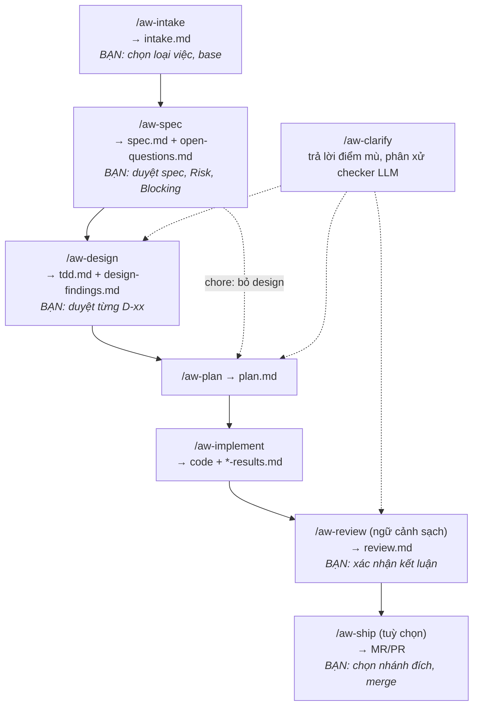

# Hướng dẫn sử dụng agent-workflow

Tài liệu cho **người** dùng quy trình: dev, tech lead, người duyệt spec/thiết kế, người rà bảo mật.
Đọc xong, bạn sẽ:

1. hiểu quy trình chạy thế nào và vì sao bạn phải làm những việc của mình;
2. cài và cấu hình được cho repo của team;
3. dẫn một việc từ ticket tới MR đã merge, biết mỗi phase sinh ra artifact nào và artifact đó
   **quyết định gì**;
4. biết đọc kết quả của máy và xử lý khi bị chặn.

| Bạn cần | Đọc |
|---|---|
| Hiểu nhanh trong 5 phút | [§1 Cách quy trình hoạt động](#1-cách-quy-trình-hoạt-động) |
| Cài cho repo lần đầu | [§2 Cài đặt và cấu hình repo đích](#2-cài-đặt-và-cấu-hình-repo-đích) |
| Làm một việc cụ thể | [§3 Vòng đời một việc](#3-vòng-đời-một-việc-từng-phase) |
| Tra artifact nào quyết định gì | [§4 Bản đồ artifact](#4-bản-đồ-artifact) |
| Bị chặn, không biết làm gì | [§9 Đọc kết quả và xử lý khi bị chặn](#9-đọc-kết-quả-và-xử-lý-khi-bị-chặn) |
| Tra lệnh | [§10 Tham chiếu lệnh](#10-tham-chiếu-lệnh) |

Tài liệu khác: [`README.md`](../README.md) (tổng quan, cài đặt rút gọn) ·
[`docs/kien-truc.md`](kien-truc.md) (lý do thiết kế, điểm yếu) ·
[`conventions-reference.md`](../workflow/templates/conventions-reference.md) (giải thích từng khoá
quy ước) · [`adapters/`](../adapters/README.md) (Claude Code, Cursor).

---

## 1. Cách quy trình hoạt động

### 1.1. Ba vai

| Vai | Làm gì | Không bao giờ làm |
|---|---|---|
| **Agent** (Claude Code, Cursor…) | Đọc file vào, viết artifact, viết code, chạy lệnh `aw` | Tự duyệt, tick ô duyệt, chọn base, chọn nhánh đích, merge |
| **Máy** (`aw check …`) | Kiểm những gì kiểm được bằng script: đủ mục, truy vết nguồn, test xanh, phạm vi diff… | Phán nội dung đúng hay sai về nghiệp vụ |
| **Người** (bạn) | Quyết định: loại việc, base, duyệt spec, duyệt từng D-xx, trả lời điểm mù, xác nhận review, chọn nhánh đích, merge | — |

Nguyên tắc: **máy kiểm được thì máy kiểm; còn lại người quyết**. Agent không bao giờ nói "đạt" thay
máy, và không bao giờ duyệt thay người.

### 1.2. Bàn giao bằng file

Mỗi phase là một hộp **file vào → file ra**. Phase sau không dựa vào hội thoại của phase trước, chỉ
đọc file. Hệ quả cho bạn:

- **Mỗi phase mở một phiên agent mới** là bình thường (và được khuyến khích) — mọi thứ cần biết đã
  nằm trong file.
- **Đổi agent giữa chừng được**: spec viết bằng Claude Code, implement bằng Cursor.
- **Sửa tay artifact được**: bạn là người viết hợp lệ. Agent chạy lại phase sẽ *cập nhật* chứ
  không ghi đè.
- **Mang tài liệu làm bằng tool khác vào giữa quy trình** qua `/aw-import`.

Artifact nằm ở `.agent-workflow/<tên-branch>/` trong worktree của việc. Thư mục này bị
`.git/info/exclude`: **không vào commit, không đi theo PR** — PR chỉ có code (và ADR/luật nghiệp vụ
nếu bạn chọn nâng, xem §7).

### 1.3. Luồng phase



Không có phase test riêng: **test xanh là điều kiện ra của implement**.

### 1.4. Hai loại điều kiện ra

Mỗi phase có:

- **Điều kiện MÁY** — một lệnh `aw check <phase>`. Agent chạy, đọc nhãn, không tự đánh giá.
- **Điều kiện NGƯỜI** — agent nêu việc bạn phải làm rồi **dừng**.

Mỗi lệnh phase kết thúc bằng ba dòng thống nhất — đọc dòng giữa trước:

```
Kết quả: …        (máy nói gì)
Cần bạn: …        (việc của bạn — nếu trống thì không cần gì)
Tiếp theo: /aw-…  (lệnh nên chạy sau)
```

### 1.5. Khối "Kết quả" của mọi lệnh `aw`

Mọi lệnh `aw` in ở cuối một khối, đánh `[x]` vào đúng một nhãn. **Đọc nhãn, không đọc mã thoát**:

```
Kết quả: check-plan.sh
  [ ] ĐẠT — được sang phase sau
  [x] KHÔNG ĐẠT — có vi phạm, sửa trong phase này
  [ ] THIẾU ĐẦU VÀO — chưa có file cần kiểm
```

Các dòng phía trên khối có ký hiệu: `✗` vi phạm (chặn), `!` cảnh báo (chưa chặn — nhưng review sẽ
chặn), `✓` đạt, `·` thông tin.

### 1.6. Chặn hay cảnh báo

| Loại kiểm | Ví dụ | Hành vi |
|---|---|---|
| Kiểm output của chính phase (chính xác) | YC có nguồn, mọi YC có task, test xanh | **Chặn** ngay |
| Kiểm chéo giữa phase (hay báo nhầm) | artifact lỗi thời, test ↔ YC, file ngoài phạm vi | **Cảnh báo** ở implement, **chặn** ở review |

Vì vậy: thấy `!` ở implement thì sửa luôn — để tới review là bị chặn.

### 1.7. Ô duyệt

Spec và mỗi D-xx có **đúng một** ô. Bạn duyệt bằng cách đổi `[ ]` thành `[x]` trong file:

```markdown
- [x] **Approved by human** — đã đọc và đồng ý toàn bộ spec <!-- approval-hash: 3f2a9c01d4e7b6a8 -->
```

- Lần đầu thấy tick, máy ghi **dấu duyệt** (hash nội dung). Nội dung đổi sau đó → `aw check`
  chặn tới khi bạn duyệt lại.
- **Duyệt lại** bản mới: đọc chỗ đổi, xoá `<!-- approval-hash: … -->`, giữ tick.
- **Agent không bao giờ tick.** Agent sửa nội dung đã tick thì phải bỏ tick. Muốn máy chặn cứng
  agent tự tick: cài hook `aw guard` (§2.7).
- Gõ `/aw-design` hay `/aw-plan` khi chưa duyệt: agent in tóm tắt **do máy dựng** (`aw approval`):
  file, dòng phải tick, điểm nên đọc kỹ — rồi hỏi bạn: *Tôi đã duyệt xong — kiểm lại* /
  *Giải thích từng điểm cần duyệt* / *Dừng — tôi duyệt sau*. Bấm nút **không** tick hộ — bạn vẫn
  phải tick trong file.

### 1.8. Worktree: mỗi việc một chỗ

```
~/code/my-repo/                   checkout chính — luôn đứng ở base_branch
~/code/my-repo.wt/feat_phi-hoan/  worktree của việc A (branch feat_phi-hoan)
~/code/my-repo.wt/fix_rounding/   worktree của việc B
```

- **Checkout chính** chỉ chạy: `/aw-intake` (tạo việc), `/aw-bootstrap` (một lần), `/aw-ship` (dọn
  việc đã merge).
- **Mọi phase khác** chạy trong worktree của việc, mỗi phase một phiên agent mới.
- Branch = thư mục worktree = thư mục artifact, cùng một tên.
- Worktree mới chỉ có file đã commit (không có `node_modules`, `.env`…) — chạy lệnh chuẩn bị
  (`WORKTREE_SETUP_CMD`) mà `aw` in ra trước khi mở phiên.

### 1.9. Engine có version, mỗi việc ghim một version

- Wrapper `aw` cài một lần mỗi máy; engine tải về cache theo version `YYYY.M.N`.
- Lúc tạo việc, `intake.md` ghi dòng `Engine: <V>`. **Mọi `aw check` của việc đó chạy đúng
  version này** — nâng engine giữa chừng không đổi luật của việc đang làm.
- Quy ước repo (`conventions.md`) cũng được đọc **tại điểm rẽ khỏi base** của việc: sửa quy ước
  trong một việc không đổi luật của chính việc đó; có hiệu lực cho việc sau khi PR merge.

---

## 2. Cài đặt và cấu hình repo đích

### 2.1. Bốn phần, ở bốn chỗ

| Phần | Ở đâu | Ai giữ | Vào git? |
|---|---|---|---|
| Wrapper `aw` | `~/.local/bin/aw` | mỗi máy, cài một lần | không |
| Engine | `~/.agent-workflow/engine/<YYYY.M.N>/` | cache, tải khi cần | không |
| **Quy ước repo** | `docs/agent-workflow/conventions.md` | cả team, sửa qua PR | **có** |
| Cấu hình bản clone | `.git/agent-workflow/` (`config.sh`, `version`, `checksums`…) | từng bản clone, mọi worktree dùng chung | không |
| Lệnh cho agent (sinh ra) | `.claude/`, `.cursor/`, `.agent-workflow/.engine/` | `aw` sinh lại | không (bị exclude) |

### 2.2. Bước 1 — cài `aw` (mỗi máy)

```sh
mkdir -p ~/.local/bin
curl -fsSL https://github.com/dangminhphuc/agent-workflow/releases/download/2026.10.23/aw -o ~/.local/bin/aw
chmod +x ~/.local/bin/aw
aw version
aw doctor          # kiểm sh, git, tar, gzip, curl/wget, sha256sum/shasum
```

Không cần Node, Python. Windows: Git Bash. `~/.local/bin` phải nằm trong `PATH`.

### 2.3. Bước 2 — `aw init` (mỗi bản clone)

```sh
cd ~/code/my-repo                  # checkout chính, đang đứng ở nhánh gốc
aw init --test-cmd "make test"     # thêm --adapter claude-code,cursor nếu team dùng cả hai
```

`aw init` làm:

1. tải engine, kiểm và **ghim** sha256;
2. tạo `.git/agent-workflow/` (`version`, `checksums`, `config.sh`, `archive/`, `journal/`);
3. thêm `/.agent-workflow/` và thư mục adapter (`/.claude/`, `/.cursor/`) vào `.git/info/exclude`;
4. sinh lệnh `/aw-*` cho agent ở checkout chính;
5. repo chưa có quy ước → tạo `docs/agent-workflow/conventions.md` từ mẫu (**không bao giờ ghi
   đè** file đã có).

Chạy lại `aw init` an toàn: file đã có thì giữ.

**Team dùng chung cấu hình máy**: đặt `version`, `checksums`, `config.sh` vào một repo riêng, mỗi
người chạy `aw init --from <url>` (`--force` để lấy đè bản ở máy).

### 2.4. Bước 3 — `config.sh` (mỗi bản clone, không commit)

Sửa `.git/agent-workflow/config.sh` (đường dẫn thật: `$(git rev-parse --git-common-dir)/agent-workflow/config.sh`):

| Khoá | Bắt buộc | Ý nghĩa | Ví dụ |
|---|---|---|---|
| `ADAPTER` | có | Agent team dùng, cách nhau dấu cách | `"claude-code cursor"` |
| `TEST_CMD` | **có** | Lệnh test — điều kiện ra của implement. Trống = `KHÔNG ĐẠT`, không phải "bỏ qua" | `"make test"` |
| `SECURITY_CMDS` | **có** | Mỗi dòng `<nhóm>: <lệnh>`, nhóm `secret \| sast \| sca \| other`. **Chép đúng lệnh, config, ngưỡng của CI** | xem dưới |
| `WORKTREE_SETUP_CMD` | nên có | Lệnh chuẩn bị worktree mới — `aw` in ra cho bạn chạy, không tự chạy | `"npm ci"` |
| `MAX_RED_RUNS` | không | Số lần một task đỏ liên tiếp trước khi máy báo DỪNG (mặc định 3) | `"3"` |
| `PERF_CMD` | chỉ khi có việc `perf` | Lệnh đo, phải in `RESULT: <số> <đơn vị>` | `"sh bench.sh"` |

```sh
SECURITY_CMDS="
secret: make security-secret
sast: make security-sast
sca: make security-sca
"
```

Mẹo: **trỏ tới target đã commit** (`make test`, `make security-*`) thay vì chép lệnh dài — lệnh thật
nằm trong git, sửa Makefile là local và CI cùng đổi. Lệnh quét phải tự thoát khác 0 khi vượt ngưỡng,
và ghi báo cáo ra ngoài repo (hoặc chỗ đã `.gitignore`) — file lạ trong repo làm kết quả bị coi là lỗi
thời. Máy dev không chạy được Sonar thì để dòng đó thành comment **kèm lý do**.

Sửa `ADAPTER` xong: chạy lại `aw init` (thêm exclude) rồi `aw adapter build` ở checkout chính.

### 2.5. Bước 4 — `conventions.md` (cả team, commit qua PR)

File `docs/agent-workflow/conventions.md` có khối ` ```conventions ` máy đọc; phần còn lại là văn xuôi
cho người (quy ước commit, MR…). Nhãn chú thích: **[edit]** phải xem lại, **[default]** dùng được
ngay, **[optional]** để trống = tắt.

Các khoá **phải xem lại** cho repo của bạn:

| Khoá | Ảnh hưởng tới | Sai thì |
|---|---|---|
| `base_branch` | nhánh checkout chính đứng, base mặc định | không tạo được worktree |
| `production_code` | chore bị cấm đụng; perf phải đo trước khi đụng | chore lọt sửa code, hoặc bị chặn oan |
| `test_files` | tìm tag `covers:`, test tái hiện bugfix, phát hiện test cũ bị xoá | cảnh báo "YC chưa có test" sai |
| `dependency_files` | chore đụng vào phải khai "Dependency upgrades" | nâng thư viện lọt không khai |
| `sensitive_code` | diff đụng vào → **người** rà bảo mật phải ký tên | code auth/payment qua review không người rà |
| `mr_target_branches` | danh sách nhánh đích khi `/aw-ship` | `aw ship create` từ chối đích |
| `jira_key_regex`, `confluence_domains` | nhận dạng input của `/aw-intake` | input bị coi là lời người `[HUMAN]` |

Các khoá khác (branch, worktree, kiến thức bền, `rules_*`, `uses_*`): xem
[`conventions-reference.md`](../workflow/templates/conventions-reference.md).

Lưu ý cú pháp: **glob** so bằng `case` của shell — `*` khớp cả `/` (`src/*` khớp `src/a/b.ts`),
không có `**`; mẫu tính từ gốc repo nên `test/*` chỉ khớp `test/` ở gốc, monorepo thêm `*/test/*`.
**Regex** là ERE, không dùng `{n}`.

Kiểm sau khi sửa:

```sh
aw conventions check     # ✗ = phải sửa; ! = đọc xem có đúng ý không
```

Rồi **commit qua PR**. Chưa merge vẫn dùng được: `aw` đọc bản ở checkout chính.

### 2.6. Bước 5 — đưa kiến thức repo vào git (khuyến nghị, một lần)

Mục tiêu: một phiên agent mới **chỉ có repo** trả lời được năm câu: hệ thống là gì, tổ chức ra sao,
chạy và kiểm thế nào, vì sao code như vậy, đang ở đâu. Câu nào agent phải đoán là chỗ thiếu.

Cách nhanh: mở agent ở checkout chính, chạy `/aw-bootstrap` (xem §6.3). Nó dựng:

```
AGENTS.md                         điểm vào 50–100 dòng, chỉ TRỎ TỚI (CLAUDE.md: một dòng @AGENTS.md)
Makefile                          setup, test, lint, security-* — đúng lệnh CI chạy
src/<module>/ARCHITECTURE.md      ràng buộc riêng của module, đặt cạnh code
docs/adr/                         quyết định đã có, có bằng chứng
```

Mẫu: `.agent-workflow/.engine/templates/target-repo/{AGENTS.md,Makefile}` (có sau `aw init`).

### 2.7. Bước 6 — hook gác ô duyệt (khuyến nghị)

Không có hook, "agent không tick" chỉ là lời dặn. Thêm vào `.claude/settings.json` (hoặc
`settings.local.json`) của repo đích:

```json
{
  "hooks": {
    "PreToolUse": [
      { "matcher": "Write|Edit|MultiEdit|NotebookEdit|Bash",
        "hooks": [{ "type": "command", "command": "aw guard pre" }] }
    ],
    "PostToolUse": [
      { "matcher": "Write|Edit|MultiEdit|NotebookEdit|Bash",
        "hooks": [{ "type": "command", "command": "aw guard post" }] }
    ]
  }
}
```

Hai hook phải cùng matcher. Bạn tick đúng lúc agent đang chạy một lệnh dài thì tick bị bỏ — tick
lại. Cursor: [`adapters/cursor/README.md`](../adapters/cursor/README.md#hook-gác-ô-duyệt).
`.claude/` bị exclude nên commit file này bằng `git add -f`.

### 2.8. Bước 7 — luật, skill, subagent của team cho từng phase (tuỳ chọn)

Khai trong `conventions.md`:

| Khoá | Agent làm gì | Dùng cho |
|---|---|---|
| `rules_<phase>` | **đọc** từng file như tài liệu (`aw rules <phase>`) | coding style, `ARCHITECTURE.md`, checklist |
| `uses_<phase>` | **gọi** từng skill/subagent (`aw uses <phase>`) | skill có tham số, `allowed-tools`, hook; subagent |

`<phase>` ∈ `spec design plan implement review`. Ví dụ:

```
rules_implement: docs/coding-style.md src/api/ARCHITECTURE.md
uses_implement: skill:go-senior agent:db-migrator
```

Điều kiện: file **đã commit vào base** (`.claude/` bị exclude → `git add -f`); skill không có
`disable-model-invocation: true`; tên không có `:` (skill của plugin phải chép vào repo). Claude
Code: cho phép gọi không hỏi bằng `{"permissions": {"allow": ["Skill(go-senior)"]}}`. Kiểm:
`aw conventions check`, `aw uses implement`. Chi tiết: [README § 4](../README.md#4-skill-subagent-của-team-cho-từng-phase-tuỳ-chọn).

Review chấm từng file `rules_*` và `uses_*`: mỗi file một dòng `pass | violation | not applicable`.
Luật/skill xếp **dưới** `spec.md`, `tdd.md`, `plan.md`: xung đột thì agent theo artifact và ghi lại.

### 2.9. Kiểm lại toàn bộ cài đặt

```sh
aw doctor                  # wrapper, engine, exclude, adapter
aw conventions check       # quy ước
aw adr check; aw rule check   # nếu dùng ADR / luật nghiệp vụ
```

Checklist cài đặt cho repo mới:

- [ ] `aw doctor` không còn `✗`
- [ ] `TEST_CMD` khai và xanh trên base
- [ ] `SECURITY_CMDS` chép đúng từ pipeline CI
- [ ] `WORKTREE_SETUP_CMD` khai
- [ ] `conventions.md`: `base_branch`, `production_code`, `test_files`, `dependency_files`,
      `sensitive_code` đúng repo; `aw conventions check` HỢP LỆ; đã commit qua PR
- [ ] (khuyến nghị) `/aw-bootstrap` đã chạy, PR đã merge
- [ ] (khuyến nghị) hook `aw guard` đã cài

---

## 3. Vòng đời một việc, từng phase

Mỗi mục dưới có: **chạy ở đâu**, **đọc → ghi**, **artifact quyết định gì**, **việc của bạn**,
**máy chặn khi**. Phiên agent mới cho mỗi phase, trừ khi ghi khác.

### Phase 00 — `/aw-intake`: tiếp nhận việc

- **Chạy ở:** checkout chính (tạo việc mới), hoặc trong worktree (thêm input).
- **Lệnh:** `/aw-intake <input…>` — tham số là danh sách input: mã Jira, URL Confluence, đường dẫn
  file, hoặc lời bạn nói. Ví dụ: `/aw-intake ABC-123 https://wiki.cty.vn/pages/123`.
- **Đọc → ghi:** input → `intake.md`.

**`intake.md` quyết định:**

| Trường | Quyết định | Ảnh hưởng |
|---|---|---|
| `Type` | loại việc: `feature \| bugfix \| refactor \| perf \| chore` | **luật của mọi phase sau** (xem §5). Sai loại = sai luật |
| `Base` | nhánh/commit việc rẽ ra | mọi checker so diff với base này |
| `Engine` | version engine | mọi `aw check` của việc chạy đúng version này |
| `Goal` | một câu mục tiêu | — |
| `## Input` | danh sách nguồn duy nhất được đọc | mọi YC sau này phải truy về đây |

**Việc của bạn:**

1. Xác nhận **loại việc**. Cây quyết định: đổi code production? Không → `chore`. Có → hành vi bên
   ngoài đổi? Không → nhanh hơn/ít tài nguyên hơn? `perf` : `refactor`. Có → hành vi hiện tại sai so
   với tài liệu/ý định? `bugfix` : `feature`. Việc hai loại → tách hai việc.
2. **Chọn base** từ đề xuất `aw worktree new` in ra (★ là gợi ý của máy, không phải lựa chọn).
3. Xác nhận danh sách input, và lời bạn được chép **nguyên văn**.
4. Chạy lệnh chuẩn bị máy in ra (`WORKTREE_SETUP_CMD`), rồi **mở phiên mới trong worktree**.

**Máy chặn khi:** thiếu loại việc/input/`Base`/`Engine`; `[JIRA]` không khớp `jira_key_regex`.
Loại việc lệch tiền tố branch → intake chỉ cảnh báo, **review chặn** (sửa loại hoặc `aw rename`).

Thêm input sau: chạy lại `/aw-intake <input mới>` trong worktree — chỉ nối thêm. Xoá input: sửa tay.
`intake.md` đổi thì `spec.md` lỗi thời → chạy lại `/aw-spec`.

### Phase 01 — `/aw-spec`: viết đặc tả

- **Chạy ở:** worktree.
- **Đọc → ghi:** input trong `intake.md` (và luật nghiệp vụ `BR-` đang active) → `spec.md`,
  `open-questions.md`.

**`spec.md` quyết định *cái gì* phải làm** — mọi phase sau đo theo nó:

| Phần | Quyết định | Ai dùng sau |
|---|---|---|
| `Risk: high \| normal` | **chế độ design**: `high` → bạn phác D-xx trước (Mode 2) | design |
| `### YC-NNN` | từng yêu cầu, có đúng một nhãn nguồn, tiêu chí chấp nhận quan sát được, `Priority: must \| should` | design (ánh xạ), plan (task phủ), implement (`covers:`), review (Lens 1) |
| `## Out of scope` | những gì **không** làm | chặn phase sau làm quá tay |
| `## Constraints & dependencies` | điều kiện ngoài phải chịu | `Risk`, D-xx |
| `## Source conflicts` | nguồn mâu thuẫn và chỗ đã chốt | — |
| `## Reproduction` (bugfix) | bước tái hiện, hành vi thật/mong đợi | test tái hiện |
| `Type`/`Protected by`/`Target` (refactor/perf) | YC giữ nguyên hành vi, test bảo vệ, chỉ số | implement, review |
| `- Promote: BR-…` | YC trở thành luật nghiệp vụ bền | implement (`aw rule promote`) |
| `Approved by human` | **cổng**: design (chore: plan) bị chặn tới khi tick | design/plan |

Nhãn nguồn của YC: `[CONFLUENCE]`, `[JIRA]`, `[FILE]` (trích từ nguồn), `[INFERRED]` (quyết định **kỹ
thuật** hiển nhiên), `[OPEN-QUESTION]` (nguồn chưa nói, đang dùng giả định tạm). Phép thử: BA/PO có
thể nói "không, ý tôi khác" không? Có → phải là `[OPEN-QUESTION]`, không được `[INFERRED]`.

**`open-questions.md` quyết định *agent đang đoán gì* và đoán sai thì tốn bao nhiêu.** Mỗi điểm mù:
nguồn nói gì, câu hỏi, hỏi ai, giả định tạm, *If wrong, redo*, và **mức chặn**:

| `Blocking` | Khi nào | Chặn |
|---|---|---|
| `blocking` | sai → cả thiết kế đổi hướng | design (chore: plan) và mọi phase sau, tới khi trả lời |
| `review-blocking` | sai → làm lại một phần code | flow chạy tiếp trên giả định; implement cảnh báo, **review chặn** |
| `non-blocking` | sai → sửa nhỏ, giao trước được | không gì; review ghi YC đó `pending` |

File này **luôn tồn tại**; không có điểm mù thì ghi "No open questions."

**Việc của bạn:**

1. Đọc danh sách YC và `Out of scope` — đây là chỗ rẻ nhất để bắt hiểu sai.
2. Duyệt mức `Blocking` của từng điểm mù (agent chỉ được đề xuất; chỉ bạn hạ mức).
3. Duyệt `Risk`. Cho qua `normal` sai thì mất lớp chống neo của Mode 2.
4. Trả lời điểm mù (`/aw-clarify`) — ít nhất các mục `blocking` trước khi design.
5. Tick **Approved by human**.

**Máy chặn khi:** YC không có nguồn, thiếu tiêu chí chấp nhận/`Priority`; mục bắt buộc để rỗng;
mâu thuẫn tự phân xử; `open-questions.md` lệch với spec (mục mồ côi, trạng thái lệch); bugfix thiếu
`Reproduction`; refactor có YC hành vi mới, hoặc YC preserve không có test bảo vệ **có sẵn trên base**.

### Lệnh tiện ích — `/aw-clarify`: chốt việc chờ người

Chạy bất kỳ lúc nào sau `/aw-spec`. Gom mọi thứ chờ bạn — điểm mù và phát hiện của checker LLM — vào
một hàng đợi **do máy xếp** (`aw pending`: việc đang chặn trước), rồi hỏi **từng mục một**, mỗi mục
có 2–3 phương án, phương án đề xuất đứng đầu kèm lý do. Bạn luôn có hai lối: tự nhập câu trả lời, hoặc
"Chat about this" để trao đổi trước khi chốt.

Agent ghi câu trả lời **nguyên văn** của bạn (ai, ngày) vào `Answer:`, đổi nhãn nguồn của YC, và nếu
câu trả lời khác giả định thì cho bạn xem dòng sẽ sửa trước khi ghi. Spec đã tick mà bị sửa → agent
bỏ tick, bạn tick lại. Chưa trả lời được → agent soạn tin nhắn tự đủ nghĩa để bạn gửi PO/BA.

**Không đồng ý một YC đã có nguồn** (agent hiểu nguồn khác bạn, tiêu chí sai, `Priority` sai) →
`/aw-clarify YC-NNN`. Đừng sửa lặng lẽ: agent ghi việc đổi thành một **điểm mù đã trả lời** trong
`open-questions.md` (cách hiểu cũ ở `Assumption`, lời bạn nguyên văn ở `Answer`), cho bạn xem dòng sẽ
sửa, đổi nhãn nguồn YC thành `[FILE] open-questions.md § YC-NNN`, bỏ tick spec. Nhờ vậy lời bạn thành
nguồn của YC, và `aw check spec` đối chiếu được hai file. Sau đó:

| Đã có | Ảnh hưởng | Việc tiếp |
|---|---|---|
| chưa có `tdd.md` | — | tick lại spec |
| `tdd.md` | lỗi thời (`based_on`): implement cảnh báo, review chặn | tick lại spec, chạy lại `/aw-design` (cập nhật mục map tới YC đó; D-xx không còn hợp → mở lại D đó) |
| `plan.md` | task `Covers`/`On assumption` YC đó về `[ ]` (`aw task reopen`); task khác giữ nguyên | chạy lại `/aw-plan`, rồi `/aw-implement` làm lại đúng các task ấy |

Thêm/bỏ YC, đổi `Out of scope` là **đổi phạm vi**: thêm vào `intake.md` dạng input `[HUMAN]`, chạy lại
`/aw-spec`. Không sửa ở spec thì sai lệch đi thẳng vào thiết kế: design không được thêm hay sửa yêu
cầu, review chấm code theo spec — code đúng một spec sai vẫn qua.

### Phase 02 — `/aw-design`: thiết kế kỹ thuật

- **Chạy ở:** worktree. **Chore bỏ qua phase này.**
- **Cần:** spec đã duyệt; không còn điểm mù `blocking` chưa trả lời.
- **Đọc → ghi:** `spec.md`, `open-questions.md`, ADR + tài liệu module liên quan → `tdd.md`,
  `design-findings.md`.

**`tdd.md` (Technical Design Document) quyết định *làm thế nào***:

| Phần | Quyết định |
|---|---|
| `## Existing code` | module sẽ đụng, quy ước code phải theo |
| `## Decisions (D-xx)` | **mỗi lựa chọn mà người khác có thể chọn khác**: vấn đề, ≥ 2 phương án + đánh đổi, lựa chọn, vì sao khó đảo ngược, ô duyệt riêng |
| Data model, Contract/API, Flow, Non-functional, Test strategy | chi tiết; mục dựa vào một D ghi `Based on: D-xx` |
| `## YC mapping` | mọi YC → mục thiết kế nào |
| `- Promote: adr` + `- Scope:` dưới D | D này trở thành ADR trong repo |
| `- Supersedes: ADR-NNNN` | D đi ngược một ADR đang hiệu lực (phải khai rõ) |

Bạn **duyệt quyết định, không duyệt văn xuôi**: đọc từng D-xx và tick ô của nó. D-xx rỗng được phép.

**Hai chế độ theo `Risk`:**

| `Risk` | Mode | Ai viết D-xx |
|---|---|---|
| `normal` | 1 | agent viết hết, bạn duyệt từng D |
| `high` | 2 | **bạn phác D-xx trước** (`Author: human`); agent viết phần còn lại và chỉ phản biện (`- Critique (agent):`) |

Mode 2 tồn tại vì thấy phương án của agent trước thì người hay neo vào nó. `high` mà chưa có D nào
`Author: human` → agent **hỏi dẫn** bạn phác: khảo sát code, liệt kê các điểm cần quyết (dạng câu hỏi, kèm
dữ kiện như số chỗ gọi, dữ liệu phải di trú), rồi hỏi từng điểm: có những cách nào, mỗi cách được/mất
gì, chọn cách nào và vì sao, chỗ nào khó đảo ngược. Agent ghi D-xx đúng lời bạn (`Author: human`),
không bao giờ đưa phương án hay nghiêng về cách nào; bạn hỏi "nên chọn gì" thì agent chỉ gợi các
khía cạnh cần cân nhắc. Muốn tự viết `tdd.md` thì nói vậy, agent dừng chờ bạn.

**`design-findings.md` quyết định *thiết kế còn lỗ ở đâu*.** Checker LLM (subagent ngữ cảnh sạch) đọc
`tdd.md` và ghi phát hiện `PH-NN`: lệch D-xx, quyết định ngầm, YC chưa thiết kế, yêu cầu mới, vi phạm
luật repo/ADR… Mỗi phát hiện `Severity: block | warn`. Checker LLM **chỉ được chặn, không được duyệt**;
thiếu file = chưa chạy = không đạt. Agent tự sửa cái nó đồng ý (`fixed`); phần còn lại bạn phân xử
qua `/aw-clarify`: đồng ý (sửa) hoặc `rejected: <lý do>`.

**Việc của bạn:** duyệt **từng** D-xx; phân xử phát hiện `block` còn mở.

**Máy chặn khi:** thiếu mục; D sai dạng; YC không được ánh xạ; còn phát hiện `block` chưa xử lý;
rejected không lý do. `/aw-plan` chặn tới khi mọi D được tick.

**Mở lại một D:** đúng một D, sửa tại chỗ, bỏ tick, thêm `Reopen reason:`. Chỉ task `Based on` D đó
quay về `[ ]` khi chạy lại plan. Bạn duyệt lại riêng D đó.

### Phase 03 — `/aw-plan`: lập kế hoạch

- **Chạy ở:** worktree. **Không có cổng người** — phase này chỉ chia việc đã duyệt, không có lựa chọn
  kỹ thuật mới.
- **Cần:** mọi D-xx đã duyệt (chore: spec đã duyệt).
- **Đọc → ghi:** `spec.md`, `tdd.md`, `open-questions.md` → `plan.md`.

**`plan.md` quyết định *phạm vi được phép của implement*:**

| Phần | Quyết định |
|---|---|
| `### T-NN` | task: `Covers` (YC), `Based on` (D-xx), `Expected files` (**ranh giới diff**), `Verify` (lệnh chứng minh xong), `Depends on`, `On assumption` |
| `Status` | `[ ]` / `[~]` / `[x]` — **chỉ máy đổi** (`aw task`) |
| `## Deferred` | YC hoãn + lý do (hoãn `must` → cảnh báo, báo bạn) |
| `## Manual verification` | YC không test tự động được + lý do |
| `## Modified existing tests` | (refactor/perf) test cũ sẽ sửa |
| `## Dependency upgrades` | (chore) thư viện nâng, chỉ `patch \| minor` |
| `## Unplanned` | implement ghi điều chưa lường, file ngoài phạm vi |

**Việc của bạn:** không bắt buộc. Nên đọc lướt `Deferred` (nhất là `must` bị hoãn) và task
`On assumption: yes`.

**Máy chặn khi:** YC không có task phủ mà không nằm trong `Deferred`; task thiếu trường. Bugfix: task
đầu phải là viết test tái hiện. Perf: task đầu phải là đo trước.

### Phase 04 — `/aw-implement`: hiện thực

- **Chạy ở:** worktree. Có thể chạy nhiều phiên (ngữ cảnh không cần sạch).
- **Đọc → ghi:** `plan.md`, `tdd.md`, `spec.md` → code, cập nhật `plan.md`, và các file **máy ghi**:

| File | Ai ghi | Quyết định |
|---|---|---|
| `task-results.md` | `aw task done` | bằng chứng từng task đã xanh (lệnh `Verify` đã chạy, output) |
| `test-results.md` | `aw check implement` | toàn bộ test xanh trên **đúng cây code** (`Tree`) |
| `security-results.md` | `aw check implement` / `aw check security` | quét bảo mật xanh, cùng lệnh với CI |
| `repro.md` | `aw check repro` (bugfix) | test tái hiện **đỏ trên code chưa sửa** |
| `perf.md` | `aw check perf --before/--after` (perf) | số đo trước/sau |

Agent **không được sửa** các file `*-results.md`, `repro.md`, `perf.md` hay `Status` của task.

**Cách máy giữ tiến độ:**

```
aw ready <dir>              đầu phiên: test xanh trên base chưa? bước tiếp là gì?
aw task next <dir>          task kế
aw task start <dir> T-NN    [ ] → [~]   (chỉ một task [~] một lúc)
aw task done <dir> T-NN     chạy Verify; chỉ XANH mới [ ] → [x]
aw task reopen <dir> YC-NNN|D-NN   YC vừa đổi / D mở lại: task phủ nó về [ ]
aw check implement <dir>    chạy toàn bộ test + quét bảo mật, ghi *-results.md
```

Đỏ liên tiếp `MAX_RED_RUNS` lần → máy báo **DỪNG**: agent ghi `Unplanned` và báo bạn thay vì thử mò.

**Việc của bạn:**

- `aw ready` đỏ trên code chưa sửa → môi trường chưa chuẩn bị hoặc base hỏng: bạn xử lý.
- Agent báo DỪNG/KẸT hoặc cần đổi `tdd.md`/`spec.md` → quyết định: mở lại D-xx (`/aw-design`), sửa
  spec (`/aw-spec`), hay thêm task.
- Báo nhầm của máy quét → agent ghi bằng chứng vào `Unplanned`; **bạn** quyết định, agent không được
  nới cấu hình quét.

**Máy chặn khi:** test hoặc quét đỏ; chưa khai `TEST_CMD`/`SECURITY_CMDS`; task `[x]` thiếu bằng chứng;
task còn `[ ]`/`[~]`; dấu xung đột merge. **Cảnh báo** (review sẽ chặn): YC chưa có test `covers:`
lẫn chưa khai thủ công, file ngoài `Expected files` không ghi `Unplanned`, test bị tắt mới thêm,
artifact lỗi thời, tài liệu module/ADR/luật bị đụng phạm vi.

### Phase 05 — `/aw-review`: rà soát độc lập

- **Chạy ở:** worktree, **ngữ cảnh sạch bắt buộc**. Claude Code: lệnh bàn giao cho subagent
  `independent-reviewer`. Agent không có subagent: **bạn mở phiên mới**, không dùng phiên đã implement.
- **Đọc → ghi:** mọi artifact + diff (so với `Base`) → `review.md`. Reviewer **không sửa code**.

**`review.md` quyết định *có được merge không*:**

| Phần | Quyết định |
|---|---|
| `Reviewed tree` | kết luận gắn với đúng cây code nào (code đổi sau đó → phải review lại) |
| `## Conclusion` | `Mergeable`, số `Blocker`, tóm tắt cho người đọc |
| Lens 1 — Spec conformance | **mỗi** YC: `pass \| partial \| fail \| pending` + bằng chứng `file:dòng` |
| Lens 2 — Design and scope | lệch D-xx, thay đổi ngoài task, task `[x]` không có dấu vết |
| `## Repo rules` | mỗi file `rules_*`/`uses_*` một verdict |
| `## Durable knowledge` | mỗi ADR/tài liệu module/luật bị đụng phạm vi: `pass \| updated \| not applicable` |
| Lens 3 — Quality | finding `[Blocker] / [Should fix] / [Nit]`, có vị trí, loại lỗi; Blocker có kịch bản lỗi |
| Lens 4 — Security | bảng **7 hạng mục cố định** (injection, authz, PII trong log, secrets, crypto, SSRF/path/deserialization, dependency mới) |
| `Security reviewer` | (khi diff đụng `sensitive_code`) **tên người** đã rà bảo mật |

Mức finding: `Blocker` = không được merge (vi phạm spec, lệch quyết định đã duyệt, lỗ hổng khai thác
được, breaking change chưa khai…); `Should fix` = đúng nhưng chất lượng có vấn đề; `Nit` = tác giả
quyết. YC đứng trên giả định chưa xác nhận → `pending`, không bao giờ `pass`.

**Việc của bạn:**

1. Đọc `Conclusion` và xác nhận kết luận.
2. Quyết định xử lý từng `Blocker`: sửa → quay lại `/aw-implement` (task mới) rồi `/aw-review` lại.
3. Diff đụng `sensitive_code` → **một người** đọc Lens 4 + diff và tự ghi `- Security reviewer: <tên>`.
   Agent không bao giờ điền dòng này.
4. Base bất thường (xếp chồng trên branch khác) → xác nhận là cố ý.
5. Máy in `[GỢI Ý]` (loại lỗi lặp ở ≥ 2 việc) → cân nhắc biến thành luật máy (lint, test).

**Máy chặn khi:** thiếu YC ở Lens 1; còn bất kỳ cảnh báo nào từ implement; kết quả test/quét không
còn mới so với code; số Blocker không khớp; Lens 4 thiếu dòng; thiếu `Security reviewer` khi cần;
loại việc lệch tiền tố branch; còn điểm mù `review-blocking` chưa trả lời.

### Phase 06 — `/aw-ship`: gửi MR và dọn (tuỳ chọn)

**Trong worktree của việc:**

1. Agent viết `merge-request.md` theo mẫu và mục "Merge request" của `conventions.md`. Máy kiểm
   (`aw check ship`) — chặn nếu review chưa đạt hoặc còn Blocker.
2. `aw ship targets` liệt kê nhánh đích → **bạn chọn** (`⚠` = sẽ kéo theo commit ngoài việc).
3. Agent cho bạn xem nguồn → đích, tiêu đề, mô tả; **bạn đồng ý** thì agent chạy `aw ship create`.
   Engine không giữ token: dùng `gh`/`glab` đã đăng nhập; không có thì đẩy branch và đưa bạn link MR
   điền sẵn (mô tả lưu ở `mr-description.md` để bạn dán).
4. `aw ship status` theo dõi; ghi `ship.md` (máy ghi, không sửa tay).
5. **Bạn review và merge trên GitHub/GitLab.** Agent không bao giờ merge, approve, bật auto-merge.

Reviewer yêu cầu sửa → `/aw-implement` (task mới) → `/aw-review` → `aw ship create … --target <cùng nhánh>`
(đẩy commit mới vào MR đang mở).

**Ở checkout chính (dọn việc đã merge):** chạy `/aw-ship` → `aw ship sweep` phân loại: *dọn được*
(mọi MR đã merge), *chờ merge*, *✗ người quyết*. Bạn đồng ý thì agent chạy `--apply`: gỡ worktree
(artifact được lưu vào `.git/agent-workflow/archive/<tên>/`), xoá branch local và origin. **Không đảo
ngược được** — agent luôn hỏi trước.

Việc không đi qua `/aw-ship`: dọn bằng `aw worktree remove`.

---

## 4. Bản đồ artifact

Tất cả nằm ở `<worktree>/.agent-workflow/<tên-branch>/`.

| Artifact | Phase sinh | Ai viết | Quyết định gì | Ai đọc sau | Người làm gì với nó |
|---|---|---|---|---|---|
| `intake.md` | intake | agent + máy (`aw input`, `Base`, `Engine`) | loại việc, base, engine, nguồn duy nhất | mọi phase, mọi checker | xác nhận loại, chọn base |
| `spec.md` | spec | agent | **cái gì** phải làm; `Risk`; phạm vi | design, plan, implement, review | đọc YC + Out of scope, duyệt Risk, **tick** |
| `open-questions.md` | spec, clarify | agent đề xuất, người trả lời | agent đang đoán gì, đoán sai tốn bao nhiêu | design (blocking), review (review-blocking) | duyệt mức chặn, trả lời |
| `tdd.md` | design | agent (Mode 2: người phác D) | **làm thế nào**; D-xx | plan, implement, review | **tick từng D-xx** |
| `design-findings.md` | design | checker LLM | lỗ của thiết kế | design (chặn), clarify | phân xử `block` |
| `plan.md` | plan, implement | agent; `Status` do máy | phạm vi được phép, thứ tự, cách chứng minh xong | implement, review | đọc `Deferred`, `Unplanned` |
| `task-results.md` | implement | **máy** | bằng chứng từng task | review | — |
| `test-results.md` | implement | **máy** | test xanh trên `Tree` nào | review, ship | — |
| `security-results.md` | implement | **máy** | quét bảo mật xanh | review, ship | quyết định báo nhầm |
| `repro.md` | implement (bugfix) | **máy** | bug được tái hiện trước khi sửa | review | — |
| `perf.md` | implement (perf) | **máy** | số đo trước/sau | review | — |
| `review.md` | review | reviewer ngữ cảnh sạch | **có được merge không** | ship | xác nhận; ký `Security reviewer` khi cần |
| `merge-request.md` | ship | agent | tiêu đề + mô tả MR | `aw ship create` | xác nhận trước khi gửi |
| `ship.md` | ship | **máy** | MR nào, trạng thái | `aw ship sweep` | — |

**Chuỗi phụ thuộc và lỗi thời.** Mỗi artifact ghi `based_on` (hash cả file đầu vào, do
`aw based-on` ghi):

```
intake.md ─▶ spec.md ─┬─▶ tdd.md ─▶ plan.md
open-questions.md ────┘
```

Sửa file phía trước → file phía sau **lỗi thời** → cảnh báo ở implement, chặn ở review. Cách xử lý:
chạy lại phase sinh ra file lỗi thời (agent sẽ cập nhật, không ghi đè).

**Ngoài thư mục việc, đi vào git qua PR** (§7): `docs/adr/NNNN-….md` (từ D-xx `Promote: adr`) và
`docs/product/rules/<miền>.md` (từ YC `Promote: BR-…`).

---

## 5. Khác nhau theo loại việc

| | `feature` | `bugfix` | `refactor` | `perf` | `chore` |
|---|---|---|---|---|---|
| Khi nào | thêm hành vi | hành vi hiện tại **sai** | đổi cấu trúc, hành vi giữ nguyên | nhanh hơn, hành vi giữ nguyên | không đụng code production |
| Spec thêm | — | `## Reproduction` | YC chỉ `preserve`/`structural`; YC preserve có `Protected by:` test **có sẵn trên base** | như refactor + YC `performance` có `Target` bằng số | — |
| Design | có | có | là phần việc chính | là phần việc chính | **bỏ** |
| Plan thêm | — | task đầu = viết test tái hiện | `Modified existing tests` | task đầu = đo trước; `Modified existing tests` | `Dependency upgrades` (`patch \| minor`) |
| Implement — máy chặn khi | — | chưa có `repro.md`, test tái hiện xanh, hoặc bước tái hiện đụng file ngoài test | xoá test cũ | `perf.md` thiếu số đo | đụng `production_code`; đụng `dependency_files` không khai, nâng major, hoặc thiếu `sca` xanh |
| Review xét thêm | — | test đỏ **vì bug**, không vì lỗi biên dịch | test cũ chỉ đổi import/cấu trúc, không đổi assertion | kết luận YC performance theo số | mức nâng thư viện đúng |

Không phải loại riêng: `hotfix` = bugfix gấp (base có thể là nhánh `release_branches`); `security` =
bugfix/feature + `Risk: high`; `utils` = feature (thêm) hoặc refactor (gom). `spike` nằm ngoài quy
trình (kết quả là kết luận, không phải code merge).

Quên `aw check repro` / `aw check perf --before` mà đã sửa code → máy từ chối: `git stash`, chạy lại,
`git stash pop`.

---

## 6. Lệnh tiện ích (không phải phase)

### 6.1. `/aw-clarify`

Xem [Phase 01](#lệnh-tiện-ích--aw-clarify-chốt-việc-chờ-người). Gọi bất kỳ lúc nào có việc chờ bạn, hoặc
`/aw-clarify YC-NNN` khi muốn đổi một YC;
`aw pending <dir>` cho bạn tự xem hàng đợi.

### 6.2. `/aw-import <file-nguồn> <spec.md|tdd.md|plan.md>`

Đưa tài liệu viết bằng tool khác (AI khác, Confluence, viết tay) vào giữa quy trình. Agent **chỉ sắp
lại theo mẫu, không thêm nội dung**: chỗ mẫu đòi mà nguồn thiếu → `[OPEN-QUESTION]` (spec) hoặc
`<THIẾU TRONG NGUỒN: …>` (tdd/plan) để checker chặn. D-xx từ tài liệu người viết → `Author: human`,
ô **chưa tick** — duyệt ở tool khác không phải duyệt ở đây. Sau đó vẫn qua checker và cổng người của
phase lẽ ra sinh ra nó.

### 6.3. `/aw-bootstrap`

Một lần cho mỗi repo (hoặc sau thay đổi bố trí lớn). Ở checkout chính: agent đề xuất worktree `chore`
(`agent-knowledge`), **bạn chọn base**. Trong worktree: khảo sát repo, dựng `Makefile`, `AGENTS.md`,
`ARCHITECTURE.md` của module, ADR cho quyết định đã có — **chỉ từ bằng chứng trong repo**; điều chỉ
người biết thành câu hỏi trong báo cáo `bootstrap.md`. Mỗi bước một commit. Cuối cùng chạy phép thử
phiên mới. **Việc của bạn:** trả lời câu hỏi trong báo cáo, sửa giá trị quy ước nó chỉ ra, mở PR
(dùng báo cáo làm mô tả), merge, rồi `aw worktree remove`.

---

## 7. Kiến thức bền: ADR và luật nghiệp vụ

Artifact của việc không vào git. Hai thứ **bạn chọn** được đưa vào git, đi theo PR của việc:

| | ADR | Luật nghiệp vụ `BR-` |
|---|---|---|
| Từ | D-xx đã duyệt có `- Promote: adr` + `- Scope: <glob>` | YC đã duyệt có `- Promote: BR-<MIỀN>-NNN` |
| Ai quyết nâng | bạn, bằng cách duyệt D đó | bạn, bằng cách duyệt spec |
| Lệnh (implement chạy, không viết tay) | `aw adr promote <dir> D-NN` | `aw rule promote <dir> YC-NNN` |
| Ghi vào | `docs/adr/NNNN-<việc>-d-NN.md` + chỉ mục `README.md` | `docs/product/rules/<miền>.md` |
| Việc sau đọc | design (`aw knowledge design`) | spec (`aw knowledge spec`) |
| Kiểm | `aw adr check` | `aw rule check` |

Nên nâng: quyết định **còn đúng sau việc này**, xuyên module, khó đảo ngược (ADR); bất biến nghiệp vụ,
không phải chi tiết màn hình, có nguồn bền (BR). YC `[INFERRED]`/`[OPEN-QUESTION]` không nâng được.

D đi ngược một ADR `accepted` phải khai `- Supersedes: ADR-NNNN` — ADR cũ thành `superseded`.

**Chống lỗi thời:** diff đụng phạm vi của tài liệu module, ADR hay file luật mà tài liệu không đổi →
implement cảnh báo; review phải ghi verdict từng tài liệu ở `## Durable knowledge`.

Hai việc song song cùng nâng ADR có thể trùng số → `aw adr check` chặn ở việc kế tiếp; bạn đổi số và
chạy lại `aw adr promote`.

---

## 8. Team, nhiều agent, nâng cấp

### Nhiều agent

```sh
aw init --adapter claude-code,cursor     # hoặc ADAPTER="claude-code cursor"
```

Mỗi worktree có cả `.claude/` lẫn `.cursor/`; đổi agent giữa các phase được. Mỗi worktree chỉ một agent
chạy tại một lúc.

### Nâng engine

```sh
aw upgrade 2026.11.1
```

Tải, ghim sha256, sinh lại adapter. **Việc đang làm không đổi luật** (chạy theo `Engine:` trong
`intake.md`). Sau khi nâng, so `conventions.md` của repo với mẫu mới
(`.agent-workflow/.engine/templates/conventions.md`) — khoá mới thiếu trong file của bạn được coi là
để trống; `aw conventions check` báo `!` cho khoá thiếu.

### Không có mạng

`AW_ENGINE_DIR` (engine có sẵn), `AW_MIRROR` (`<mirror>/<V>/agent-workflow-<V>.tar.gz` + `SHA256SUMS`,
nhận `file://`), `AW_CACHE`.

### Từ bộ cài cũ

Repo còn `.agent-workflow/.quy-trinh/`: `aw init --from-legacy` chép cấu hình sang `.git/agent-workflow/`
và chỉ in lệnh `git rm` để bạn dọn bằng một PR.

---

## 9. Đọc kết quả và xử lý khi bị chặn

### Nhãn hay gặp

| Lệnh | Nhãn | Làm gì |
|---|---|---|
| `aw check <phase>` | `ĐẠT` | sang phase sau |
| | `KHÔNG ĐẠT` | sửa các dòng `✗` **trong phase này** |
| | `THIẾU ĐẦU VÀO` | chạy phase trước |
| `aw ready` | `CHƯA SẴN SÀNG` | sửa các dòng `✗` (thường: chưa chạy `WORKTREE_SETUP_CMD`, base đỏ, chưa khai `TEST_CMD`) |
| `aw approval` | `CHƯA DUYỆT` | đọc tóm tắt, tick ô trong file |
| `aw pending` | `CÓ VIỆC ĐANG CHẶN` | `/aw-clarify` |
| `aw task` | `DỪNG` | agent đã đỏ nhiều lần: đọc `Unplanned`, quyết định hướng đi |
| | `KẸT` | task còn lại chờ phụ thuộc: xem `Depends on` |
| `aw worktree new` | `ĐÃ CÓ WORKTREE` | mở phiên ở đường dẫn được in |
| `aw conventions check` | `KHÔNG HỢP LỆ` | sửa dòng `✗` trong `conventions.md` |
| `aw ship create` | `KÉO THEO COMMIT NGOÀI VIỆC` | chọn đích khác, tạo branch mới + cherry-pick, hoặc chấp nhận |
| | `KHÔNG TẠO ĐƯỢC MR` | mở link điền sẵn, tạo MR tay, đưa link lại cho agent |

### Tình huống thường gặp

| Triệu chứng | Nguyên nhân | Xử lý |
|---|---|---|
| `/aw-design` dừng ngay | spec chưa tick, hoặc còn điểm mù `blocking` | tick spec; `/aw-clarify` |
| Đã tick mà vẫn bị chặn "nội dung đổi sau khi duyệt" | spec/D sửa sau khi tick | đọc chỗ đổi, xoá `<!-- approval-hash: … -->`, giữ tick |
| Tick bị bỏ mất | hook `aw guard` thấy tick xảy ra lúc agent đang chạy | tick lại khi agent rảnh |
| `/aw-design` hỏi bạn từng điểm cần quyết thay vì tự viết D | `Risk: high` (Mode 2) | trả lời để agent ghi D-xx `Author: human`, hoặc tự viết vào `tdd.md`, hoặc hạ `Risk` nếu thật sự sai (bạn quyết) |
| implement `KHÔNG ĐẠT` "chưa khai lệnh test/quét" | `TEST_CMD`/`SECURITY_CMDS` trống | khai trong `config.sh` |
| `aw ready` đỏ trên code chưa sửa | thiếu dependency hoặc base hỏng | chạy `WORKTREE_SETUP_CMD`; base hỏng thì sửa ở việc khác hoặc chọn base khác |
| review chặn "kết quả không còn mới" | code đổi sau `aw check implement` | chạy lại `aw check implement` (hoặc `aw check security`), rồi review lại |
| review chặn "loại việc lệch tiền tố branch" | `Type` khác tiền tố | sửa `Type`, hoặc `aw rename` rồi mở phiên ở đường dẫn mới |
| review chặn artifact lỗi thời | sửa `spec.md`/`tdd.md` sau khi phase sau chạy | chạy lại phase sau để cập nhật |
| Muốn chore sửa test cạnh code (`src/a.test.ts`) mà bị chặn | file khớp cả `production_code` | thu hẹp `production_code` trong quy ước |
| Bugfix bị từ chối ở `aw check repro` | đã sửa code trước khi tái hiện | `git stash`, chạy lại, `git stash pop` |
| Muốn quy ước mới có hiệu lực cho việc hiện tại | việc đọc quy ước tại điểm rẽ khỏi base | không được — merge PR quy ước rồi tạo việc mới |

### Khi máy để lọt lỗi

Agent làm sai mà không checker nào bắt → ghi lại để team biết harness hỏng ở đâu:

```sh
aw journal add <task|context|env|verify|state|model> "<sai gì, ở đâu, harness thiếu gì>"
aw journal          # tổng hợp: checker trượt ở đâu, loại lỗi lặp lại
```

Loại lỗi lặp ở ≥ 2 việc → review in `[GỢI Ý]` nâng thành luật máy. Máy không tự thêm luật.

---

## 10. Tham chiếu lệnh

### Lệnh trong agent

| Lệnh | Chạy ở | Việc |
|---|---|---|
| `/aw-intake <input…>` | checkout chính / worktree | tạo việc, worktree, `intake.md`; thêm input |
| `/aw-spec` | worktree | `spec.md`, `open-questions.md` |
| `/aw-clarify` | worktree | chốt điểm mù, phân xử checker LLM |
| `/aw-design` | worktree | `tdd.md`, `design-findings.md` |
| `/aw-plan` | worktree | `plan.md` |
| `/aw-implement` | worktree | code + kết quả test, quét |
| `/aw-review` | worktree, ngữ cảnh sạch | `review.md` |
| `/aw-ship` | worktree / checkout chính | gửi MR / dọn việc đã merge |
| `/aw-import <nguồn> <đích>` | worktree | đưa artifact ngoài vào |
| `/aw-bootstrap` | checkout chính rồi worktree | đưa kiến thức repo vào git (một lần) |

### Lệnh `aw` bạn hay dùng trực tiếp

| Lệnh | Việc |
|---|---|
| `aw init [--adapter a,b] [--test-cmd "…"] [--from <url>] [--from-legacy]` | cài cho bản clone |
| `aw upgrade <V>` · `aw version` · `aw doctor` | nâng engine · version · kiểm cài đặt |
| `aw conventions check` | kiểm quy ước |
| `aw ready <dir> [--no-test]` | worktree sẵn sàng chưa, bước tiếp là gì |
| `aw check <tên> <dir>` | checker: `intake spec design plan implement security review repro perf ship` |
| `aw pending <dir>` | việc đang chờ bạn |
| `aw approval design\|plan <dir>` | tóm tắt cần duyệt trước khi vào design / plan |
| `aw task next\|start\|done <dir> [T-NN]` · `aw task reopen <dir> <YC-NNN\|D-NN>` | trạng thái task; đưa task bị ảnh hưởng về `[ ]` |
| `aw worktree new\|status\|remove …` | đề xuất / tạo / xem / dọn worktree |
| `aw rename <tên-branch-mới>` | đổi tên việc (branch, worktree, artifact) — chạy trong worktree |
| `aw ship targets\|create\|status\|sweep …` | MR/PR |
| `aw adr check` · `aw rule check` | kiểm ADR · luật nghiệp vụ |
| `aw rules <phase>` · `aw uses <phase>` | xem luật/skill khai cho phase |
| `aw adapter build [a,b] [--force]` | sinh lại lệnh cho agent |
| `aw journal` · `aw journal add <lớp> "…"` | nhật ký harness |

`<dir>` là thư mục artifact của việc: `.agent-workflow/<tên-branch>`.

---

## 11. Tóm tắt: những gì chỉ bạn làm

| Lúc | Việc của bạn |
|---|---|
| Cài đặt | `TEST_CMD`, `SECURITY_CMDS` đúng CI; `conventions.md` đúng repo, merge qua PR |
| Intake | chọn **loại việc**, chọn **base**, xác nhận input; chạy lệnh chuẩn bị, mở phiên trong worktree |
| Spec | đọc YC + `Out of scope`; duyệt `Risk`, mức `Blocking`; **tick spec** |
| Bất kỳ lúc nào | trả lời điểm mù (`/aw-clarify`), hỏi PO/BA khi cần |
| Design | `Risk: high` → phác D-xx trước; **tick từng D-xx**; phân xử phát hiện checker LLM |
| Implement | xử lý khi agent báo DỪNG/KẸT, base đỏ, báo nhầm của máy quét |
| Review | xác nhận kết luận; quyết Blocker; **ký Security reviewer** khi đụng code nhạy cảm |
| Ship | **chọn nhánh đích**, xác nhận nội dung MR, **review và merge**, đồng ý dọn |

## 12. Giới hạn cần biết

- **Qua hết checker ≠ làm đúng.** Máy kiểm hình thức (có nguồn, đủ mục, test xanh), không kiểm YC có
  đúng ý BRD. Đọc spec của bạn là lớp bảo vệ chính.
- **Máy không biết ai tick.** Không cài hook `aw guard` thì agent tự tick vẫn lọt.
- **File máy ghi giả được** (`*-results.md`): máy chặn việc *quên*, không chặn gian lận có chủ ý;
  review ngữ cảnh sạch là lớp sau.
- **Review không chạy lại test.** Lệnh local lệch pipeline thì local xanh mà CI vẫn chặn — giữ
  `SECURITY_CMDS`, `TEST_CMD` trùng CI.
- **Artifact không đi theo PR**: reviewer trên GitHub/GitLab chỉ thấy code (và ADR/BR đã nâng). Mô tả
  MR (`merge-request.md`) là cầu nối.
- **Glob `*` khớp cả `/`**: `src/*` rộng hơn bạn tưởng.
- `06-ship` chỉ lo MR, không lo deploy/tag/release note.

Danh sách đầy đủ: [`docs/kien-truc.md` § Những chỗ thiết kế này yếu](kien-truc.md#những-chỗ-thiết-kế-này-yếu).
